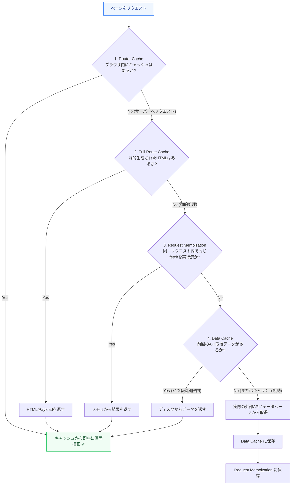

Next.js App Router では、フォルダ構造がそのままルーティングになり、コンポーネントの中で非常にシンプルにデータをフェッチできます。さらに、ページの読み込み速度を最大化するために強力なキャッシュ機構が備わっています。

第2章では、App Router のルーティング構造、データ取得方法、そして複雑な「4つのキャッシュ」について図解で解説します。

---

## 1. App Router のルーティング構造

フォルダ名がURLパスになり、そのフォルダ内に配置する特別なファイル名によって役割が決まります。

*   **`page.tsx`**: そのルートの固有UI（ページ本体）。
*   **`layout.tsx`**: 複数のページで共有されるUI（ヘッダー、サイドバーなど）。再レンダリングされず状態が維持されます。
*   **`loading.tsx`**: ページの読み込み中に表示されるローディングUI（自動的にReact Suspenseでラップされます）。
*   **`error.tsx`**: エラー発生時に表示される代替UI。

---

## 2. Server Components でのデータフェッチ

RSC（Server Components）では、コンポーネント自体を `async` 関数にすることで、`useEffect` や `fetch` を使ったフックなしで直接データを非同期で取得できます。

```tsx:app/posts/page.tsx
// サーバーコンポーネントなので、async/await が直接使える
export default async function PostsPage() {
  const res = await fetch('https://api.example.com/posts');
  const posts = await res.json();

  return (
    <div>
      <h1>記事一覧</h1>
      <ul>
        {posts.map((post: any) => (
          <li key={post.id}>{post.title}</li>
        ))}
      </ul>
    </div>
  );
}
```

---

## 3. Next.jsの「4つのキャッシュ」と判定フロー（図解）

Next.jsには、パフォーマンス向上とAPIへの負荷を減らすため、4つの独立したキャッシュシステムが存在します。

### キャッシュの概要

| キャッシュ名 | 対象 | 保存場所 | 目的 |
| :--- | :--- | :--- | :--- |
| **Request Memoization** | 同一リクエスト内の `fetch` 重複 | サーバーメモリ | 1回のリクエスト中で同じAPI呼び出しをまとめる |
| **Data Cache** | 異なるリクエスト間のAPIデータ | サーバーのディスク/メモリ | データベースやAPIのデータを保存して再利用する |
| **Full Route Cache** | ページ全体のHTMLとRSC Payload | サーバーのディスク | ビルド時や初回アクセス時に静的にページを丸ごと生成する |
| **Router Cache** | 画面遷移時のページデータ | ブラウザメモリ | ユーザーが画面遷移する際の待ち時間をゼロにする |

### データ取得とキャッシュ判定フロー



### キャッシュの制御方法

Next.js 15以降では、`fetch` のデフォルトの挙動はキャッシュしない（`no-store`）仕様へと変更されました。そのため、データをキャッシュして再利用したい場合は、明示的にオプションを指定する必要があります。

```typescript
// キャッシュを強制的に保存する（SSG / キャッシュ再利用向け）
fetch('https://api.example.com/data', { cache: 'force-cache' });

// キャッシュを一切使わず、毎回最新データを取得する（デフォルト動作 / SSR向け）
// ※ Next.js 15以降は明示しなくてもデフォルトで no-store として動作します
fetch('https://api.example.com/data', { cache: 'no-store' });

// 3600秒間（1時間）はキャッシュを再利用し、それを過ぎたらバックグラウンドで再検証する（ISR向け）
fetch('https://api.example.com/data', { next: { revalidate: 3600 } });
```

---

## まとめ

*   **App Router** はフォルダ名がルーティングになり、`layout.tsx` や `page.tsx` を組み合わせてページを組み立てる。
*   **Server Components** では `async/await` を用いて、サーバー上で直接かつ安全にデータを取得可能。
*   Next.jsの **4つのキャッシュ** は、ブラウザ（Router Cache）からサーバーのAPI取得（Data Cache）まで細かく連携し、高速化とサーバー負荷の軽減に貢献している。
