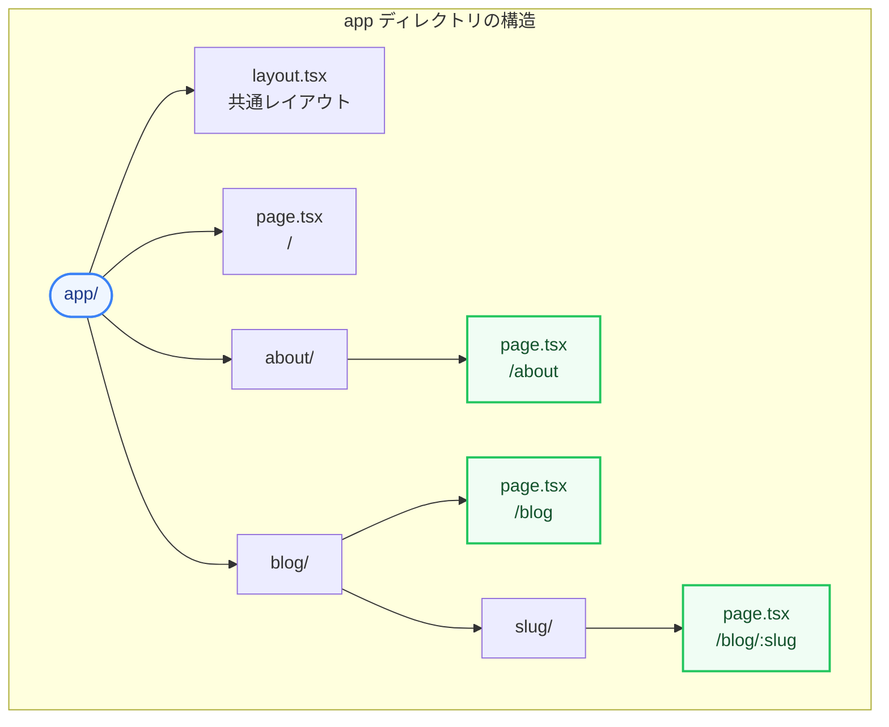
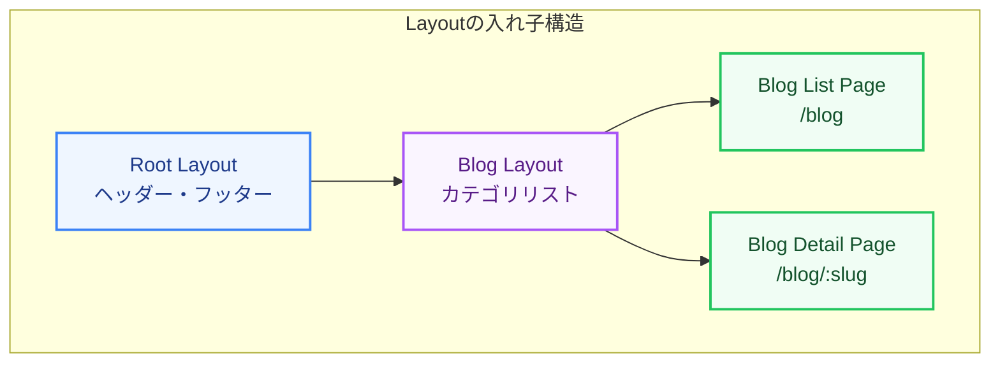

Next.js App Routerでは、ファイルシステムをベースとした直感的なルーティングと、状態を維持できる入れ子（ネスト）状のレイアウトシステムが採用されています。

第3章では、フォルダー構成がどのようにページURLに対応するのか、そして画面全体を効率的に構成するためのレイアウトやテンプレート、ルートグループの仕組みを図解で解説します。

---

## 1. ファイルシステムベースのルーティング

App Routerでは、`app` ディレクトリ内のフォルダー構造がそのままURLパスになります。
ページとして公開するルートには、必ずフォルダー内に `page.tsx`（または `.jsx`）を配置する必要があります。



* **動的ルーティング (`[slug]`)**: 
  フォルダー名をブラケットで囲む（例: `[id]` や `[slug]`）ことで、動的なURLパラメータ（例: `/blog/nextjs-routing`）を受け取るページを作成できます。

---

## 2. レイアウト（Layout）とテンプレート（Template）

画面を構築する際、ヘッダーやサイドナビゲーションなどの「共通UI」を定義するために `layout.tsx` と `template.tsx` を使用します。

### レイアウト（Layout）の特徴
* **状態の維持 (State Preservation)**: ユーザーが子ルート間で遷移しても、レイアウトは再レンダリングされず、レイアウト内の状態（入力フォームの値やスクロール位置など）が維持されます。
* **DOMの再作成なし**: 遷移時にレイアウト部分のHTML要素は破棄されず、効率的に再利用されます。

### テンプレート（Template）の特徴
* **毎回リセットされる**: レイアウトと似ていますが、ルート遷移するたびにテンプレート内のインスタンスが新しく作成され、状態はリセットされます。
* **ユースケース**: ページ遷移ごとのフェードインアニメーションや、アクセス解析のページビュー計測（`useEffect` の再実行）を行いたい場合に適しています。



---

## 3. ルートグループ（Route Groups）

「URLのパス名には影響を与えたくないが、特定のページ群だけに共通のレイアウトを適用したい」または「ファイルを論理的なグループで整理したい」という場合には、**ルートグループ** を使用します。

フォルダー名を丸括弧で囲む（例: `(marketing)` や `(dashboard)`）ことで、そのフォルダー名はURLのパスから除外されます。

### 具体例
以下のようにフォルダーを構成すると、URLは `/login` や `/dashboard` になりつつ、それぞれ異なるレイアウトを適用できます。

* `app/(auth)/layout.tsx` (認証画面用のシンプルなレイアウト)
* `app/(auth)/login/page.tsx` → URLは **/login**
* `app/(main)/layout.tsx` (ヘッダーやサイドナビ付きの標準レイアウト)
* `app/(main)/dashboard/page.tsx` → URLは **/dashboard**

---

## 4. コードで見る Layout の基本構造

ルートレイアウト（`app/layout.tsx`）は、アプリケーションの最上位でHTMLタグやBodyタグを定義する必須のファイルです。

```tsx:app/layout.tsx
import './globals.css';
import Header from '@/components/Header';
import Footer from '@/components/Footer';

// layoutコンポーネントは children を受け取る必要があります
export default function RootLayout({
  children,
}: {
  children: React.ReactNode;
}) {
  return (
    <html lang="ja">
      <body>
        <Header />
        <main>{children}</main> {/* ここに各ページのコンテンツが埋め込まれる */}
        <Footer />
      </body>
    </html>
  );
}
```

レイアウトをネスト（入れ子）にすることで、無駄な再レンダリングを防ぎながら、美しく一貫性のあるユーザーインターフェースを構築できます。次のステップでは、このルーティングと密接に関わるデータ取得（Data Fetching）の仕組みを学んでいきましょう！
