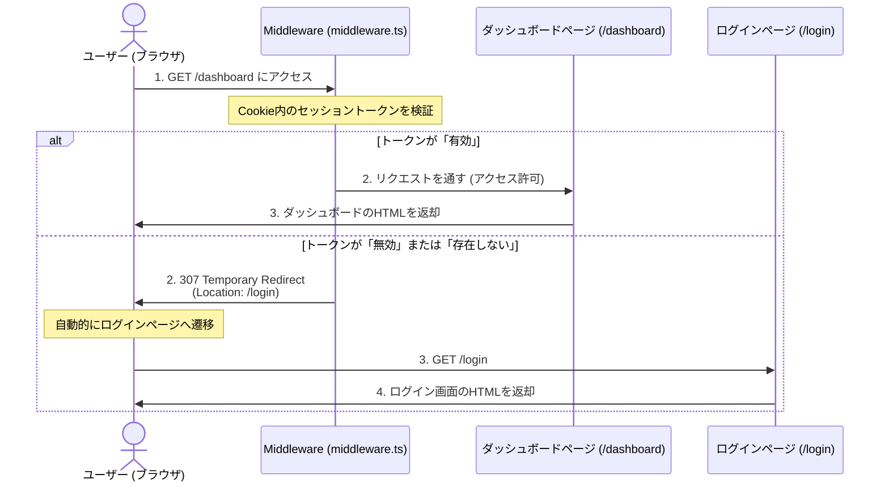

Next.js App Router を用いたアプリケーション構築において、特定のルート（ダッシュボードやマイページなど）へのアクセスを制限する「認証ゲート（ログインチェック）」や、IP・地域制限を実装する際に欠かせないのが **Middleware（ミドルウェア）** です。本章では、Middleware の仕組みとセキュアな認証制御の設計について解説します。

---

## 1. Middleware とは？

Next.js の Middleware は、リクエストがサーバーまたはエッジ（Vercelなど）に到達し、ページやAPIにルーティングされる **直前** に実行されるコードです。

### 役割と特徴
*   **初期処理の共通化**: リクエストのヘッダー書き換え、ログ出力、認証状態の検証などを一括で行えます。
*   **高速なレスポンス**: サーバーがHTMLやデータを生成する前に実行されるため、認証エラーによるリダイレクトを極めて高速に処理できます。

---

## 2. Middleware を介した認証フロー（図解）

ログインしていないユーザーが、認証必須ページ（`/dashboard`）にアクセスした際のリクエストの流れを示します。



---

## 3. 実践的な Middleware のコード例

プロジェクトのルートディレクトリ（`src/` 配下を使用している場合は `src/middleware.ts`）に配置します。

```typescript:middleware.ts
import { NextResponse } from 'next/server';
import type { NextRequest } from 'next/server';

export function middleware(request: NextRequest) {
  // 1. Cookie から認証トークンを取得
  const token = request.cookies.get('auth_token')?.value;

  const { pathname } = request.nextUrl;

  // 2. 認証トークンがなく、アクセス先がダッシュボード配下の場合
  if (!token && pathname.startsWith('/dashboard')) {
    // ログイン後に元のページに戻れるよう、クエリパラメータに戻り先を含めてリダイレクト
    const loginUrl = new URL('/login', request.url);
    loginUrl.searchParams.set('from', pathname);
    return NextResponse.redirect(loginUrl);
  }

  // 3. トークンがある、または認証不要ルートの場合はそのまま次の処理へ
  return NextResponse.next();
}

// 4. Middleware を適用するルートを限定する (matcher の指定)
export const config = {
  matcher: [
    /*
     * /dashboard 配下のすべてのルート、および特定のパスにのみ適用する
     * 静的ファイルや画像（_next/static, publicなど）を除外してパフォーマンスを維持
     */
    '/dashboard/:path*',
  ],
};
```

---

## 4. API や Server Actions での認証検証

Middleware によるチェックは「ページの遷移を防ぐ」ための一次防衛線であり、**安全なAPIやデータ通信の担保には不十分** です。なぜなら、直接APIを叩くなどして悪意あるリクエストを送信することが可能なためです。

そのため、データを取得・書き換える **Server Actions** や **Route Handlers** の中では、必ず個別にセッションの検証を行い、二重に認証を強制する必要があります。

```typescript:action.ts
'use server'

import { cookies } from 'next/headers';
import { redirect } from 'next/navigation';

export async function updateProfile(formData: FormData) {
  const cookieStore = await cookies();
  const token = cookieStore.get('auth_token')?.value;

  // 二重のセキュリティチェック (サーバーサイドでの本検証)
  if (!token) {
    redirect('/login');
  }

  // プロフィール更新処理を実行
}
```

---

## まとめ

*   **Middleware** はリクエストがページに届く前に動作し、認証やリダイレクトを制御する。
*   **`NextResponse.redirect()`** で未認証ユーザーを瞬時にログイン画面へ流す。
*   Middleware は一次防衛線であり、**Server Actions や API の中でも二重の認証チェックが必須** である。
