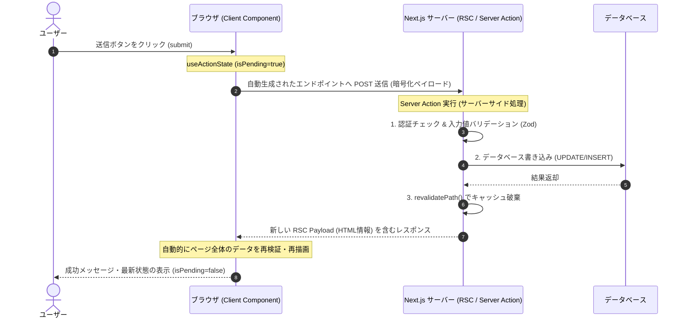

Next.js App Router では、APIルート（`/api/route.ts`）を個別に定義することなく、サーバー上で実行される非同期関数をクライアントコンポーネントから直接呼び出す仕組みである **「Server Actions（サーバーアクション）」** が提供されています。

第5章では、Server Actions の仕組み、具体的な実装方法、および実務で必須となるセキュリティ・バリデーション設計について解説します。

---

## 1. Server Actions とは？

Server Actions は、クライアントとサーバー間のシームレスなデータ更新を実現する仕組みです。
背後では、Next.js が自動的に HTTP POST リクエストの API エンドポイントを生成して通信をトンネリングします。

### 主なメリット
*   **APIエンドポイント定義の不要化**: データ更新ロジックをコンポーネントの近く、あるいは専用のサーバーモジュールに隠蔽できます。
*   **Progressive Enhancement（段階的エンハンスメント）**: JavaScript がブラウザでロードされる前、あるいは無効化されている状態でも、標準的な HTML フォーム送信として動作します。
*   **型の安全性 (Type Safety)**: サーバー上の関数定義がそのままクライアント側で呼び出せるため、パラメータや戻り値の型が完全に保証されます。

---

## 2. Server Actions のデータフロー（図解）

クライアントが Server Actions を実行し、データ更新後に画面が再検証（再描画）される流れは以下の通りです。



---

## 3. 基本的な実装例

### サーバー側の Action 定義
ファイルまたは関数ブロックの先頭に `"use server"` ディレクティブを記述することで、そのコードがサーバーでのみ実行されることを明示します。

```typescript:src/actions/todo.ts
"use server";

import { revalidatePath } from 'next/cache';

// 擬似データベース
let todos = [{ id: 1, text: "Next.js 15 を学ぶ" }];

export async function createTodoAction(prevState: any, formData: FormData) {
  const text = formData.get("todoText") as string;

  // 単純なバリデーション
  if (!text || text.length < 3) {
    return { success: false, error: "タスクは3文字以上で入力してください。" };
  }

  // データベースへの挿入をシミュレート
  todos.push({ id: Date.now(), text });

  // キャッシュの再検証（ページに最新データを反映させる）
  revalidatePath('/todos');

  return { success: true, error: null };
}
```

### クライアント側のフォーム実装

```tsx:app/todos/page.tsx
"use client";

import { useActionState } from 'react';
import { createTodoAction } from '@/actions/todo';

export default function TodoPage() {
  // useActionState で Server Action とフォーム状態を接続
  const [state, formAction, isPending] = useActionState(createTodoAction, {
    success: false,
    error: null
  });

  return (
    <div className="max-w-md mx-auto p-6">
      <h1 className="text-2xl font-bold mb-4">タスク管理</h1>
      
      <form action={formAction} className="space-y-4">
        <input
          name="todoText"
          type="text"
          placeholder="新しいタスクを入力"
          className="border p-2 w-full rounded"
          required
        />
        <button
          type="submit"
          disabled={isPending}
          className="bg-blue-500 text-white p-2 rounded w-full disabled:bg-gray-400"
        >
          {isPending ? "追加中..." : "追加する"}
        </button>
      </form>

      {state.error && (
        <p className="text-red-500 mt-2">{state.error}</p>
      )}
      {state.success && (
        <p className="text-green-500 mt-2">タスクが追加されました！</p>
      )}
    </div>
  );
}
```

---

## 4. セキュリティ・堅牢性設計のベストプラクティス

Server Actions は、実質的にパブリックな API エンドポイントを公開することと同じです。そのため、セキュリティ上の対策が極めて重要です。

### ① Zod による厳密なスキーマ検証
クライアントから送られてくる `FormData` やオブジェクトの値は、必ずサーバーサイドでスキーマ検証を行います。

```typescript:src/actions/secure-action.ts
"use server";

import { z } from 'zod';

const schema = z.object({
  email: z.string().email({ message: "無効なメールアドレス形式です。" }),
  age: z.number().min(18, { message: "18歳以上である必要があります。" })
});

export async function subscribeNewsletter(prevState: any, data: { email: string; age: number }) {
  // Zod でバリデーション実行
  const parsed = schema.safeParse(data);
  
  if (!parsed.success) {
    // バリデーションエラーメッセージを返す
    return {
      success: false,
      errors: parsed.error.flatten().fieldErrors
    };
  }

  // 処理を実行...
  return { success: true, errors: {} };
}
```

### ② 認証と認可の徹底
ユーザーの操作が許可されているか、セッション情報を確認してからデータベースにアクセスします。

```typescript:src/actions/delete-action.ts
"use server";

import { getSession } from '@/lib/auth'; // 任意のセッション取得ライブラリ

export async function deletePostAction(postId: string) {
  const session = await getSession();

  // 1. ログイン確認
  if (!session || !session.user) {
    throw new Error("認可エラー: ログインが必要です。");
  }

  // 2. 権限確認 (自分が作成した記事か確認)
  const isOwner = await checkPostOwnership(postId, session.user.id);
  if (!isOwner) {
    throw new Error("認可エラー: この操作は許可されていません。");
  }

  // 削除処理...
}
```

---

## まとめ

*   **Server Actions** は API エンドポイントを意識せず、サーバー側の関数をクライアントから透過的に呼び出せる機能。
*   **Progressive Enhancement** に対応しており、JavaScript なしでも動作する頑強な UI/UX を提供可能。
*   実体は公開 API エンドポイントと同じであるため、**Zod 等によるバリデーション** と **サーバー側での認証・認可** の実装が不可欠。
*   データの更新後は、**`revalidatePath`** または **`revalidateTag`** を呼び出して、キャッシュを適切に更新する。
