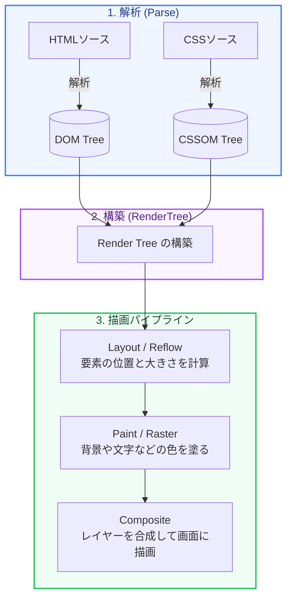

Webサイトの表示速度や操作時の応答性は、ユーザーの離脱率や検索エンジンの評価（SEO）に決定的な影響を与えます。

パフォーマンスを最適化するには、ブラウザが裏側でどのようにページを描画しているか（**レンダリングパイプライン**）を理解することが近道です。

第1章では、ブラウザの描画プロセスと、Googleが提唱するユーザー体験の重要指標 **Core Web Vitals（コア・ウェブ・バイタル）** の関係を図解します。

---

## 1. ブラウザのレンダリングパイプライン（図解）

ブラウザがサーバーからHTML、CSS、JavaScriptを受け取り、画面にピクセルとして描画するまでのステップです。

1.  **DOM / CSSOMの構築**: HTMLを解析してドキュメントツリー（DOM）を作り、CSSを解析してスタイルツリー（CSSOM）を作ります。
2.  **Render Treeの構築**: 画面上に表示される要素とスタイルを結合した「レンダーツリー」を作ります（`display: none` の要素は除外されます）。
3.  **Layout (レイアウト/リフロー)**: 各要素が画面のどの位置にどのサイズで配置されるかを計算します。
4.  **Paint (ペイント)**: 要素の背景色、テキスト、境界線などのピクセルデータを塗る処理（ラスタライズ）を行います。
5.  **Composite (コンポジット/レイヤー合成)**: 要素をレイヤーに分け、GPUを使って重ね合わせて最終的な画面を描画します。

---

## 2. Core Web Vitals の3大重要指標

Googleがユーザー体験（UX）を評価するために定めた、特に重要な3つのパフォーマンス指標です。

### 1. LCP (Largest Contentful Paint) - 最大コンテンツの描画時間
*   **意味**: ページ内で最も大きいコンテンツ（ヒーロー画像やメインの見出しなど）が表示されるまでの時間。
*   **目安**: **2.5秒以下** が「良好 (Good)」。
*   **改善アプローチ**: 画像の最適化、サーバーの応答時間（TTFB）の短縮、レンダリングをブロックするCSS/JSの削減。

### 2. INP (Interaction to Next Paint) - 次の描画までの応答性
*   **意味**: ユーザーがクリックやキー入力をした際、ブラウザが次の画面（描画フレーム）を更新するまでの遅延時間。
*   **目安**: **200ミリ秒以下** が「良好 (Good)」。
*   **改善アプローチ**: JavaScriptの重い処理の最適化（メインスレッドの占有時間を減らす）、`requestIdleCallback` の活用、不要なスクリプトの削減。

### 3. CLS (Cumulative Layout Shift) - 累積レイアウトシフト
*   **意味**: 読み込みの途中で、画像や広告が遅れて表示されることで画面のレイアウトがカクッとズレる視覚的な不安定さ。
*   **目安**: **0.1以下** が「良好 (Good)」。
*   **改善アプローチ**: 画像や広告枠にあらかじめ `width` / `height` を指定しておく、コンテンツの動的挿入を避ける。

---

## まとめ

*   ブラウザの描画は **DOM/CSSOM構築 → Render Tree構築 → Layout → Paint → Composite** というパイプラインを辿る。
*   JavaScriptやCSSによるパイプラインの再実行（特に Layout の再計算）を減らすことが高速化に繋がる。
*   **LCP** (表示速度)、**INP** (応答性)、**CLS** (視覚的安定性) を最適化することが、優れたUXとSEO評価の両立において重要である。

次の章では、LCPやCLSに最も影響を与える「画像の最適化」について、具体的な実装方法を交えて学びましょう！
