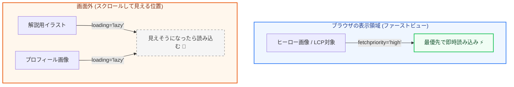

Webサイトの総ファイル容量のうち、大半を占めるのが「画像データ」です。画像を適切に最適化することは、表示速度（LCP）の向上や、レイアウトシフト（CLS）の防止において最も効果的な手段の1つです。

第2章では、モダンな画像形式の選定方法、CLSを防ぐコーディング、そして表示速度を高めるリソース読み込み制御のテクニックについて図解します。

---

## 1. モダンな画像フォーマットの選定

従来の JPEG や PNG と比較して、画質をほとんど落とさずにファイル容量を大幅に削減できる次世代の画像フォーマット（WebP、AVIF）の採用が推奨されます。

| フォーマット | 特徴 | 圧縮率（JPEG比） | 透過・アニメーション | 推奨用途 |
| :--- | :--- | :--- | :--- | :--- |
| **WebP** | 現在の標準的な次世代フォーマット。ほぼすべての主要ブラウザで対応。 | 約 30% 削減 | 対応 | 一般的な写真やイラスト |
| **AVIF** | WebPよりさらに圧縮率が高い新世代フォーマット。 | 約 50% 削減 | 対応 | 高解像度の写真やグラフィカルな画像 |
| **SVG** | ベクター形式。解像度に依存しない。 | 極めて軽量（コード） | 対応 | ロゴ、アイコン、単純なイラスト |

---

## 2. CLS（レイアウトシフト）を防ぐ width と height

画像が読み込まれる前に、ブラウザはその画像が表示される領域の大きさを把握できません。そのため、画像が後から読み込まれた瞬間に周囲のコンテンツが押し下げられ、レイアウトシフト（CLS）が発生します。

これを防ぐには、HTMLの `img` タグに **`width` と `height` 属性を必ず指定** します。

```html
<!-- ✕ 悪い例: 読み込まれるまでサイズが0になり、ガタツキが発生する -->


<!-- ◯ 良い例: 画像読み込み前からアスペクト比（縦横比）の領域が確保される -->

```

### CSSの `aspect-ratio` との併用

HTMLに `width` と `height` を設定しておくと、ブラウザは自動的にアスペクト比を計算し、CSSでレスポンシブ対応（`width: 100%; height: auto;`）にしても、読み込み前の領域確保が維持されます。

```css
img {
  width: 100%;
  height: auto;
  /* または明示的に指定 */
  aspect-ratio: 16 / 9; 
}
```

---

## 3. リソース読み込みの優先度制御（図解）

すべての画像を一度に読み込むと、ブラウザの通信帯域が圧迫され、ページの初期表示（LCP）が遅れてしまいます。表示位置に合わせて読み込みの優先度を適切に割り振る必要があります。



### ファーストビュー（画面内）の画像：優先度を上げる
ファーストビューにある画像（特にLCPの対象となるヒーロー画像）には、`loading="lazy"` を指定してはいけません。むしろ、最優先で読み込むようにブラウザに指示を出します。

```html

```

### スクロールしないと見えない画像：遅延読み込み（Lazy Loading）
画面外にある画像は、ユーザーがスクロールしてその領域に近づくまで読み込みを遅らせることで、無駄な通信とCPU消費をカットします。

```html

```

---

## まとめ

*   画像ファイルは **WebP や AVIF** などの次世代フォーマットに変換して使用する。
*   **`width` と `height`** を指定することで、ブラウザがアスペクト比を計算し、**レイアウトシフト（CLS）** を100%防ぐことができる。
*   ファーストビューの重要画像には **`fetchpriority="high"`** を付与し、それ以外の画像は **`loading="lazy"`** で遅延読み込みさせることで、初期表示速度（LCP）を最大化できる。
