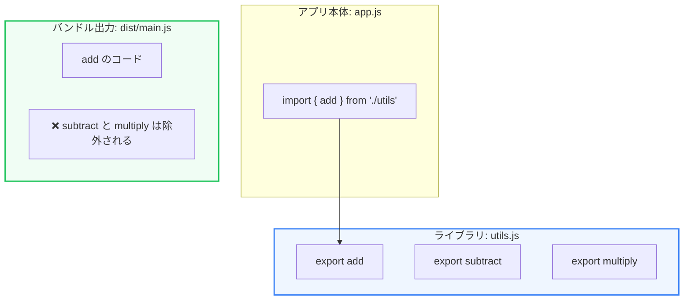

モダンなWebフロントエンド開発では、リッチなUIを実現するために多くのライブラリ（npmパッケージ）を導入しがちです。しかし、それに伴ってJavaScript（JS）のファイルサイズが膨れ上がると、ブラウザでのダウンロードと解析・実行に時間がかかり、ページ読み込み（LCP）やインタラクション性（INP）が著しく悪化します。

第4章では、不要なJSコードを削り、配信を最適化するための主要なアプローチを学びます。

---

## 1. Tree Shaking（デッドコード排除）

**Tree Shaking（ツリーシェイキング）** とは、利用していない不要なコード（デッドコード）をビルド結果から自動で除外する技術です。



### Tree Shakingを有効にする条件
Tree Shakingは、JavaScriptのモジュールシステムが **ESModules (`import` / `export`)** である必要があります。CommonJS（`require` / `module.exports`）は動的に読み込むことができるため、ビルドツールが「本当に使われていないか」を事前に静的解析できず、Tree Shakingが機能しません。

---

## 2. Code Splitting と Lazy Loading

ユーザーが最初のページを開いた際、すべてのページのJSコードが詰まった巨大な単一ファイルをダウンロードするのは非効率です。これを解決するのが **Code Splitting（コード分割）** です。

必要になるまでそのコードをロードしない **Lazy Loading（遅延読み込み）** を組み合わせます。

### 実装例（動的インポート）

Reactなどのコンポーネントや、特定の大きなヘルパーライブラリ（例: グラフ描画用の `Chart.js` など）は、動的インポート（Dynamic Import）を使って別ファイルに切り出します。

```javascript
// ボタンをクリックしたときだけ重いライブラリをロードする
button.addEventListener('click', async () => {
  // ここで初めてネットワーク経由で chunk ファイルがダウンロードされる
  const { calculateHeavyMath } = await import('./math-utils.js');
  calculateHeavyMath();
});
```

Reactでは `React.lazy` と `Suspense` を使用して、ページ（ルーター）単位で簡単にコードを分割できます。

```tsx
import React, { Suspense, lazy } from 'react';

// ダッシュボードページは初期読み込みから分離して遅延ロードさせる
const Dashboard = lazy(() => import('./pages/Dashboard'));

function App() {
  return (
    <Suspense fallback={<div>Loading...</div>}>
      <Dashboard />
    </Suspense>
  );
}
```

---

## 3. バンドルサイズの可視化

最適化を行うための第一歩は、「どのライブラリがバンドルの大部分を占めているか」を可視化することです。

* **Webpack Bundle Analyzer** / **Vite Bundle Visualizer**
  * ビルドされた結果に含まれる全ファイルをモザイク状の面積グラフとしてWebブラウザ上で確認できます。

これらを用いて、例えば「日付操作のためだけに巨大な `moment.js` をバンドルしていたため、軽量な `dayjs` に置き換える」「`lodash` から全関数ではなく特定の関数だけをインポートする」といった具体的な軽量化の判断（リファクタリング）を下すことができます。
