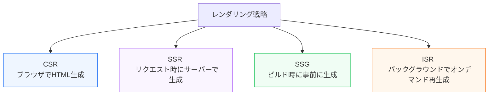

Webアプリケーションのパフォーマンスは、**「どのタイミングで、どこでHTMLを組み立ててブラウザに表示するか」** というレンダリング戦略に大きく依存します。それぞれの戦略には、表示速度、SEO（検索エンジン最適化）、開発コスト、データのリアルタイム性において異なるトレードオフが存在します。

第5章では、現代の主要な4つのレンダリング戦略（CSR, SSR, SSG, ISR）のパフォーマンス特性と選定基準について学びます。

---

## 1. 4つの主要なレンダリング戦略

### CSR (Client-Side Rendering)
空のHTMLを受け取った後、ブラウザ上でJavaScriptを実行してDOMを組み立てて画面を描画します。
* **メリット**: ページ遷移がスムーズ（SPA）、サーバー側の負荷が極めて低い。
* **デメリット**: 初期表示（FCP/LCP）が遅い。JSの解析が終わるまで真っ白な画面が続く。
* **適したユースケース**: 管理画面（ダッシュボード）、ログイン必須のマイページ。

### SSR (Server-Side Rendering)
ユーザーがアクセスした瞬間に、サーバー上でデータベースからデータを取得してHTMLを組み立て、完成したHTMLをブラウザに返します。
* **メリット**: 初期表示が速い。クローラーがHTMLを直接読み込めるためSEOに有利。
* **デメリット**: アクセスが集中するとサーバー（CPU）の負荷が高まる。TTFB（最初の1バイトを受け取るまでの時間）が延びる。
* **適したユースケース**: リアルタイムな株価やユーザー毎のタイムライン表示が必要なサイト。

### SSG (Static Site Generation)
ビルド時にあらかじめ全ページのデータを収集し、静的なHTMLファイルをディスクに出力しておきます。アクセス時はCDN経由でファイルを高速返却するだけです。
* **メリット**: パフォーマンスが最高（LCPが極めて良好）。サーバー維持費が非常に安い。
* **デメリット**: データが変わるたびにサイト全体を再ビルドする必要がある。
* **適したユースケース**: ブログ、製品紹介サイト、ドキュメントサイト。

### ISR (Incremental Static Regeneration)
SSGのように静的ページを即座に返しつつ、指定した有効期限（Revalidate期間）が過ぎたあとのリクエストをトリガーに、バックグラウンドで特定のページだけをサーバーサイドで静的再生成します。
* **メリット**: ビルド時間が長くならず、古いデータが表示され続ける問題も解決できる。
* **デメリット**: 有効期限直後のユーザーには一世代古いキャッシュが表示される（裏で再生成は走る）。
* **適したユースケース**: ECサイトの製品一覧、ニュースメディア。

---

## 2. パフォーマンス特性とトレードオフ

各戦略のパフォーマンス指標（Core Web Vitalsなど）に対する影響は以下の通りです。

| 指標/特性 | CSR | SSR | SSG | ISR |
| :--- | :--- | :--- | :--- | :--- |
| **初期表示速度 (LCP)** | ⚠️ 遅い (JSロード待ち) | ◯ 速い | 🚀 最速 (CDN配信) | 🚀 最速 (CDN配信) |
| **応答開始時間 (TTFB)** | 🚀 最速 (空HTML) | ⚠️ 遅い (サーバー処理) | 🚀 最速 (静的ファイル) | 🚀 最速 (静的ファイル) |
| **SEOの強さ** | ⚠️ 弱い (一部クローラー非対応) | 🚀 強い | 🚀 強い | 🚀 強い |
| **リアルタイム性** | ◯ 高い | 🚀 非常に高い | ❌ 低い | ◯ 中程度 |
| **サーバー負荷** | 🚀 極小 | ⚠️ 高い | 🚀 極小 | ◯ 低い |

一つのWebアプリにおいてどれか一つの戦略に絞る必要はありません。Next.jsなどのモダンフレームワークでは、ダッシュボードは **CSR**、静的な利用規約は **SSG**、頻繁に変わる商品詳細は **ISR** のように、**ページ単位で最適なレンダリング戦略を選択・ブレンドする**設計がベストプラクティスとされています。
