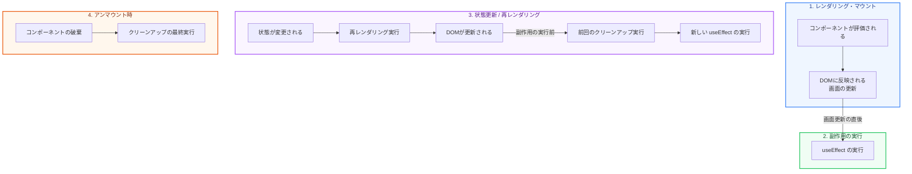

React の機能である **Hooks（フック）** は、関数コンポーネントの中で状態管理や副作用（API通信、DOM操作など）を扱うための仕組みです。

第1章では、最も頻繁に使用される `useState` と `useEffect` を取り上げ、コンポーネントがどのように「レンダリング」され、「副作用が実行されるか」というライフサイクルの流れを図解で学びます。

---

## 1. useState による状態管理の基本

`useState` は、コンポーネント内に「状態（State）」を持たせるためのフックです。状態が更新されると、Reactはコンポーネントを再レンダリング（再描画）します。

```tsx
const [count, setCount] = useState<number>(0);
```

* **`count` (状態変数)**: 現在保持されている値です。
* **`setCount` (更新関数)**: 値を更新するための関数です。これを使って値を変更すると、Reactに再レンダリングがトリガーされます。

---

## 2. useEffect のライフサイクルと実行タイミング

`useEffect` は、レンダリング結果が画面に反映された「後」に実行される副作用（Side Effect）を定義します。

### 実行の流れ（ライフサイクル）



### 依存配列（Dependencies）による制御

`useEffect` の第2引数に渡す配列によって、実行タイミングを制御できます。

| 依存配列の指定 | 実行されるタイミング |
| :--- | :--- |
| **指定なし** (`useEffect(() => {})`) | **毎回のレンダリング後** に常に実行される |
| **空の配列** (`useEffect(() => {}, [])`) | **初回のマウント時（画面表示時）のみ** 実行される |
| **値あり** (`useEffect(() => {}, [count])`) | 初回マウント時 ＆ **`count` の値が変わったときのみ** 実行される |

---

## 3. クリーンアップ関数（Cleanup）の重要性

`useEffect` 内でイベントリスナーの登録やタイマーの設置（`setInterval`）を行った場合、コンポーネントが消える（アンマウント）前や、次の副作用が実行される前に、それらを解除（クリーンアップ）する必要があります。

これを怠ると、**メモリリーク** や予期しないバグの原因になります。

### クリーンアップの書き方

```tsx
import { useState, useEffect } from 'react';

export default function Timer() {
  const [seconds, setSeconds] = useState(0);

  useEffect(() => {
    // 1秒ごとにカウントアップするタイマーをセット
    const intervalId = setInterval(() => {
      setSeconds((prev) => prev + 1);
    }, 1000);

    // クリーンアップ関数を返す
    return () => {
      clearInterval(intervalId); // コンポーネント消滅時や再実行前にタイマーを解除
      console.log('タイマーが解除されました');
    };
  }, []); // 空の配列なので、マウント時に1回だけタイマーをセット

  return <div>起動時間: {seconds} 秒</div>;
}
```

コンポーネブラウザ上で非表示になる際、Reactは自動的にこの返された関数（`() => clearInterval(intervalId)`）を呼び出して、タイマーをストップします。

次のチャプターでは、これらを応用して独自のロジックを切り出す「カスタムフック」について学びます！
