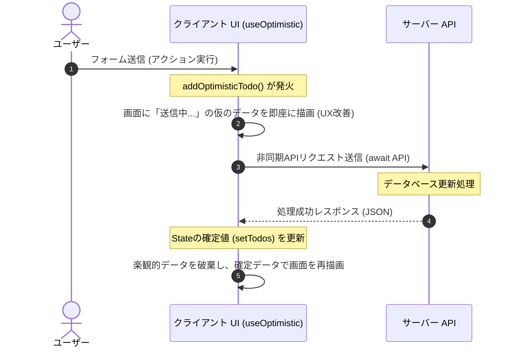

React 19 では、非同期処理（Actions）とフォームの状態管理をネイティブにサポートするための強力な Hooks が追加されました。これらにより、以前は `useState` や `useEffect`、手動のローディング制御を組み合わせて書いていた複雑な非同期ロジックを、シンプルかつ安全に記述できるようになります。

本章では、React 19 のコア機能である新しい Hooks と `use` API の仕組み・使い方を学びます。

---

## 1. React 19 における「Actions」の概念

React 19 では、データを更新する非同期関数を **「Action（アクション）」** と呼びます。
Action を呼び出すと、React は自動的に以下の処理をバックグラウンドで開始します。

*   **自動ローディング管理**: 非同期処理の開始から終了まで、ローディング状態を自動追跡します。
*   **状態の自動同期**: UI の更新処理とデータフェッチの競合を防ぎます。
*   **エラーハンドリング**: 境界（Error Boundary）へのスムーズなエラー伝播。

---

## 2. 新しい 3 つのフォーム関連 Hooks

### ① useActionState (旧 useFormState)
フォームのアクション（非同期処理）を実行し、その「実行結果」「ローディング状態（isPending）」「アクション関数」を返します。

```tsx:action-state.tsx
import { useActionState } from 'react';

// 送信をシミュレートする非同期アクション
async function updateProfile(prevState: any, formData: FormData) {
  try {
    const name = formData.get("username");
    // API呼び出しをシミュレート
    await new Promise((resolve) => setTimeout(resolve, 1000));
    return { success: true, message: `プロフィールを ${name} に更新しました！` };
  } catch (error) {
    return { success: false, message: "更新に失敗しました。" };
  }
}

export function ProfileForm() {
  // useActionState(非同期関数, 初期状態)
  const [state, formAction, isPending] = useActionState(updateProfile, null);

  return (
    <form action={formAction}>
      <input name="username" type="text" placeholder="新しい名前" required />
      <button type="submit" disabled={isPending}>
        {isPending ? '更新中...' : '更新する'}
      </button>
      {state && (
        <p style={{ color: state.success ? 'green' : 'red' }}>
          {state.message}
        </p>
      )}
    </form>
  );
}
```

### ② useFormStatus
親子コンポーネント間で、親 `<form>` の送信ステータスをコンテキスト経由で取得します。これにより、サブミットボタンを別コンポーネント化しても、フォームの送信状態に応じてボタンを非活性化するなどの制御が簡単になります。

> [!IMPORTANT]
> `useFormStatus` は、**`<form>` の内側に配置された子コンポーネント**の中で使用する必要があります。同一コンポーネントの `useFormStatus` は親フォームの情報を検知できません。

```tsx:submit-button.tsx
import { useFormStatus } from 'react-dom';

export function SubmitButton() {
  // 親 <form> のステータスを読み取る
  const { pending, data, method, action } = useFormStatus();

  return (
    <button type="submit" disabled={pending}>
      {pending ? '送信中...' : '送信'}
    </button>
  );
}
```

### ③ useOptimistic
サーバーの処理完了を待つ前に、UI を一時的に「成功した想定のデータ（楽観的データ）」で更新します。レスポンス時間をゼロに見せることで、極めて滑らかな UX を実現します。

```tsx:todo-list.tsx
import { useOptimistic, useState } from 'react';

type Todo = { id: number; text: string };

export function TodoApp() {
  const [todos, setTodos] = useState<Todo[]>([
    { id: 1, text: "React 19 を学ぶ" }
  ]);

  // useOptimistic(同期された真の状態, 楽観的状態を生成するリデューサー関数)
  const [optimisticTodos, addOptimisticTodo] = useOptimistic(
    todos,
    (currentTodos, newTodoText: string) => [
      ...currentTodos,
      { id: Date.now(), text: `${newTodoText} (送信中...)` }
    ]
  );

  async function handleAddTodo(formData: FormData) {
    const text = formData.get("todoText") as string;
    if (!text) return;

    // 1. サーバー応答を待たずにUIに一時追加
    addOptimisticTodo(text);

    // 2. サーバー送信を実行
    await new Promise((resolve) => setTimeout(resolve, 1500)); // 擬似遅延
    
    // 3. 真の状態を更新（これにより楽観的状態が破棄され、真の状態と同期する）
    setTodos((prev) => [...prev, { id: Date.now(), text }]);
  }

  return (
    <div>
      <form action={handleAddTodo}>
        <input name="todoText" type="text" placeholder="タスクを追加" required />
        <button type="submit">追加</button>
      </form>
      <ul>
        {optimisticTodos.map((todo) => (
          <li key={todo.id}>{todo.text}</li>
        ))}
      </ul>
    </div>
  );
}
```

---

## 3. 楽観的アップデート（Optimistic UI）のデータフロー（図解）

`useOptimistic` を用いた楽観的アップデートの処理フローは以下のようになります。



---

## 4. `use` API によるリソースの読み込み

React 19 では、新しい `use` API が追加されました。これは `use` という新しい組み込み関数で、**レンダリング中に直接 Promise や Context を読み込む** ことができます。

従来の Hooks とは異なり、`use` は `if` 文の中や `for` ループの中で条件付きで呼び出すことが可能です。

### Promise を読み込む（データの非同期読み込み）

```tsx:data-fetch-use.tsx
import { use, Suspense } from 'react';

// APIからデータを取得するPromise（サーバー/クライアント間で共有）
const dataPromise = fetch('https://api.example.com/message')
  .then(res => res.json())
  .then(data => data.message);

function MessageComponent() {
  // use を使って Promise の結果を直接読み取る
  // Promiseが解決するまで、親の Suspense がフォールバックを表示する
  const message = use(dataPromise);
  return <p>サーバーからのメッセージ: {message}</p>;
}

export function App() {
  return (
    <Suspense fallback={<div>メッセージを取得中...</div>}>
      <MessageComponent />
    </Suspense>
  );
}
```

---

## まとめ

*   **React 19** は非同期のデータ更新（Actions）をネイティブで追跡し、ローディングとエラー制御を自動化する。
*   **`useActionState`** はフォームのアクション結果と `isPending` 状態を一体として管理できる。
*   **`useFormStatus`** は子コンポーネントから直接、所属する親フォームの送信状態にアクセスできる。
*   **`useOptimistic`** はサーバーのレスポンスを待たずにUIを変更し、ユーザーの体感速度を最大化する。
*   **`use` API** は `if` やループの中でも使用可能で、Promise や Context を動的に読み込む新しい手段を提供する。
