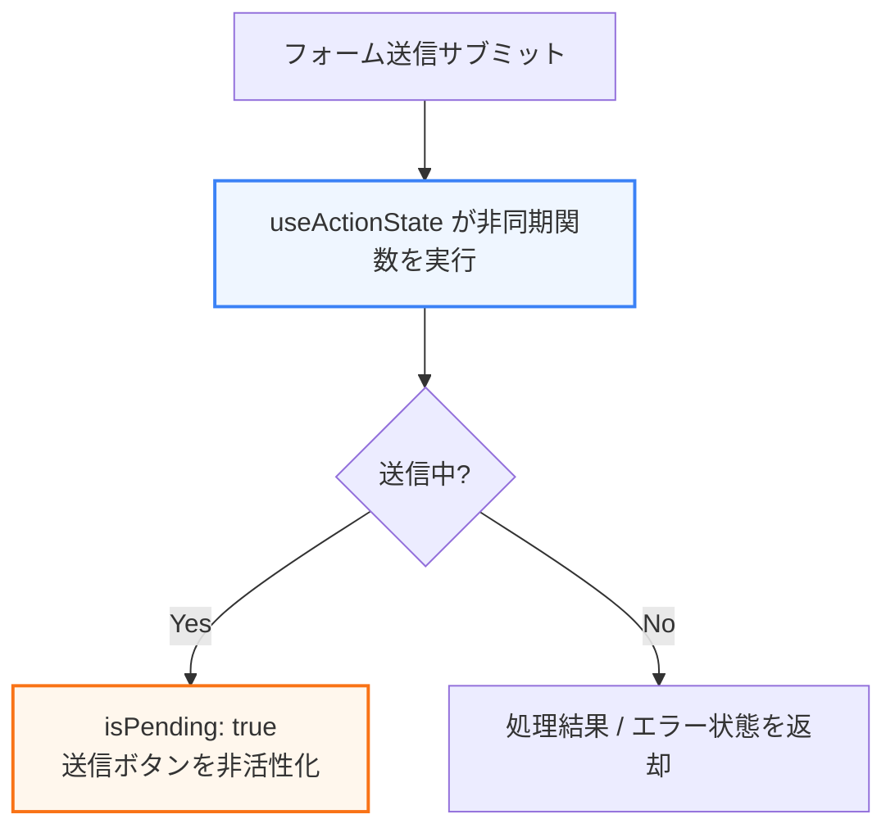

Reactアプリケーションの複雑度が増すにつれて、単純な `useState` と `useEffect` だけでは、パフォーマンスやデータ更新のUX（ユーザー体験）を良好に保つことが難しくなります。特にUIのレスポンス性を損なわずに非同期データ処理を行うため、ReactはトランジションAPIやReact 19で新たなフックを導入しました。

第5章では、アプリケーションを次のレベルに引き上げる高度なフックとReact 19の新機能について学びます。

---

## 1. トランジションAPI (useTransition / useDeferredValue)

通常、Reactの状態（state）が変わると、Reactは即座に再レンダリングを実行し、完了するまでブラウザの描画をブロックします。そのため、重い処理があると画面がフリーズしたように感じられます。

**`useTransition`** は、状態更新の優先度を「緊急ではない（Transition）」ものとして扱うためのフックです。

```javascript
const [isPending, startTransition] = useTransition();

const handleChange = (e) => {
  // 高優先度: 入力欄のテキスト変更は即座に反映させる
  setInputValue(e.target.value);

  // 低優先度: フィルタリングされた重いリストの再計算はバックグラウンドで行う
  startTransition(() => {
    setSearchQuery(e.target.value);
  });
};
```

* **`isPending`**: トランジションがバックグラウンドで処理中（実行中）であるかどうかを示すブーリアン値です。これを使ってローディングスピナーなどを表示できます。
* **`useDeferredValue`**: `useTransition` が「状態更新を行う関数」をラップするのに対し、受け取った「値」自体の更新を遅延させるフックです。

---

## 2. React 19 の非同期アクション用フック

React 19では、非同期処理（データ送信や更新）に伴うローディング状態やエラーハンドリングを簡素化するために、**「アクション（Actions）」** という概念と専用のフックが追加されました。



### `useActionState` (旧 useFormState)
フォーム送信などの非同期処理を扱う際、これまで手動で管理していた `isLoading` や `error` のステートを自動的に管理します。

```tsx
// React 19 アクションフックの例
const [state, formAction, isPending] = useActionState(
  async (prevState, formData) => {
    try {
      await updateProfile(formData.get("name"));
      return { success: true, error: null };
    } catch (e) {
      return { success: false, error: e.message };
    }
  },
  { success: false, error: null }
);

return (
  <form action={formAction}>
    <input name="name" type="text" />
    <button type="submit" disabled={isPending}>
      {isPending ? "保存中..." : "保存"}
    </button>
    {state.error && <p>{state.error}</p>}
  </form>
);
```

### `useOptimistic` (楽観的更新)
サーバーへのリクエストが完了する前に、**「おそらく成功するだろう」** と予測して、UI上に即座に変更結果を反映させる「楽観的更新（Optimistic Updates）」をシンプルに実現するフックです。
送信が完了すると本番のデータと自動的に置き換わり、失敗した場合は元の状態へ自動ロールバックされます。

---

## 3. useSyncExternalStore

Reactの管轄外にある外部のデータストア（Reduxなどの独自状態管理ライブラリ、ブラウザの `window.navigator.onLine` やメディアクエリ `window.matchMedia` など）と、Reactのコンポーネントの状態を安全に同期・サブスクライブするためのフックです。

`useEffect` を使った手動同期で発生しがちだった、レンダリング中の一貫性の欠如（テイアリング現象）を防ぎ、並行レンダリング（Concurrent Mode）において安全に動作することを保証します。
