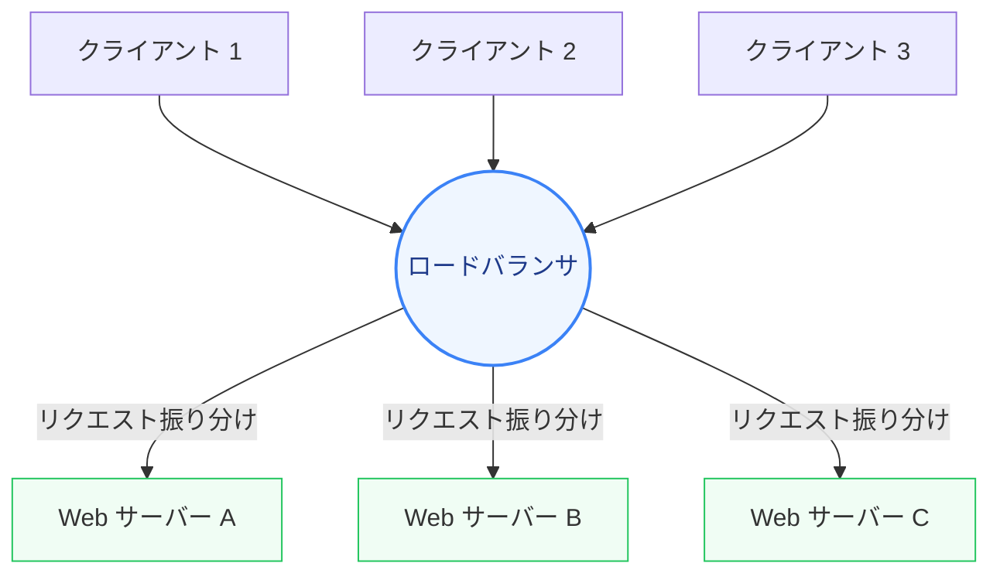

Web アプリケーションやシステムが成長し、アクセス数が増加するにつれて、「いかにしてシステムをダウンさせず、高速に応答し続けるか」が極めて重要になります。

第1章では、システム設計（システムデザイン）の基礎概念であるスケーリング手法、ロードバランサによる負荷分散、および高可用性を実現する冗長化の仕組みについて学びます。

---

## 1. 垂直スケーリング vs 水平スケーリング

システムにかかる負荷を処理するために、サーバーのキャパシティを増やす方法は大きく分けて2つあります。

| 比較項目 | 垂直スケーリング (スケールアップ) | 水平スケーリング (スケールアウト) |
| :--- | :--- | :--- |
| **アプローチ** | 単一サーバーのCPU、メモリ、SSDなどのスペックを強化する。 | サーバーの数を増やし、処理を分散させる。 |
| **主なメリット** | 構成が単純。アプリケーションの修正が不要。 | 理論上、無限にスケールできる。コスト効率が高い。 |
| **主なデメリット** | ハードウェアの物理限界がある。スペック増強に伴うコスト増加が非線形。 | システムが複雑になる。セッションやデータの共有設計が必要。 |
| **適した用途** | データベースサーバーの初期段階、構成変更を最小限にしたい場合。 | 大規模Webサイト、マイクロサービス、Webアプリケーション層。 |

---

## 2. ロードバランサによる負荷分散

水平スケーリングを行う場合、クライアントからのリクエストを複数のサーバーに適切に振り分ける **「ロードバランサ（Load Balancer: 負荷分散装置）」** が不可欠になります。

### L4 ロードバランサ vs L7 ロードバランサ
ロードバランサは、動作する OSI 参照モデルのレイヤーによって分類されます。

1.  **L4 ロードバランサ (レイヤー4 - トランスポート層)**
    *   **特徴**: IPアドレスやポート番号（TCP/UDP）の情報に基づいてルーティングします。
    *   **利点**: パケットの中身（HTTPヘッダーやデータ部）をパースしないため、極めて高速に処理できます。
2.  **L7 ロードバランサ (レイヤー7 - アプリケーション層)**
    *   **特徴**: HTTP/HTTPS ヘッダー、クッキー、URL パス、リクエストボディなどの情報に基づいてルーティングします。
    *   **利点**: `/api/*` は API サーバーへ、`/static/*` は静的配信サーバーへといった柔軟な条件分岐（コンテンツベースのルーティング）や、SSL終端（SSL復号化）が可能です。

### 主要なルーティングアルゴリズム
*   **ラウンドロビン (Round Robin)**: サーバーリストの順番通りに均等に割り振る。サーバーのスペックが均一な場合に適する。
*   **重み付きラウンドロビン (Weighted Round Robin)**: サーバーの処理能力に応じて「重み（比重）」を設定し、スペックの高いサーバーにより多くのリクエストを割り振る。
*   **最小接続 (Least Connections)**: 現在アクティブな接続数が最も少ないサーバーに優先して割り振る。処理時間の長いリクエストが多い場合に有効。
*   **IPハッシュ (IP Hash)**: クライアントのIPアドレスからハッシュ値を計算し、転送先サーバーを固定する。セッションを特定のサーバーで保持したい場合（ステートフル）に使用。

---

## 3. 高可用性（High Availability）と単一障害点（SPOF）

システムデザインにおいて最も避けるべきなのが、**SPOF（Single Point of Failure: 単一障害点）** です。SPOF とは、そこが停止するとシステム全体が停止してしまうようなコンポーネントを指します。

### 可用性（SLA）の算出方法
稼働率（システムが正常に稼働している時間割合）を計算する際、コンポーネントの接続方式によってシステム全体の稼働率は大きく変化します。

#### 1. 直列接続（コンポーネントがすべて正常である必要がある場合）
データベースとアプリケーションサーバーのように、両方が動いていなければならない構成です。

$$稼働率 = 稼働率_A \times 稼働率_B$$

> [!NOTE]
> 例：稼働率 $99\%$ のコンポーネントが2つ直列に繋がると、全体の稼働率は $99\% \times 99\% = 98.01\%$ に低下します。

#### 2. 並列接続（どちらか一方が動いていれば良い場合：冗長化）
ロードバランサ配下の複数のサーバーのように、片方が壊れてもサービスが継続できる構成です。

$$稼働率 = 1 - (1 - 稼働率_A) \times (1 - 稼働率_B)$$

> [!NOTE]
> 例：稼働率 $99\%$ のサーバーを2台並列化すると、全体の稼働率は $1 - (0.01 \times 0.01) = 99.99\%$ に向上します。

### アプリケーションのステートレス化
水平スケーリングと高可用性を達成するためには、Web サーバーを **「ステートレス（状態を持たない）」** に設計することが極めて重要です。
セッション情報やアップロードされたファイルをサーバーのローカルメモリやローカルディスクに保存するのではなく、外部の Redis（分散セッションキャッシュ）や S3（オブジェクトストレージ）に集約することで、どのサーバーが停止してもユーザーは他のサーバーで継続して処理を受けることができます。

---

## まとめ

*   **水平スケーリング**はサーバー台数を増やすアプローチで、大規模システム設計の基本である。
*   **ロードバランサ**はL4とL7の使い分けがあり、用途に応じて適切なルーティングアルゴリズムを選択する。
*   SPOF を排除するためには、**並列冗長化**を導入し、アプリケーションサーバーを**ステートレス**にする必要がある。
