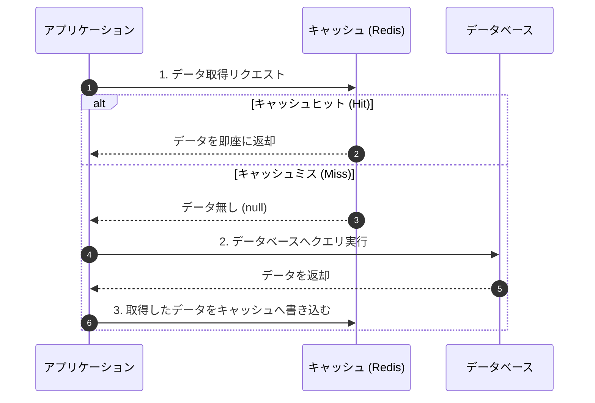
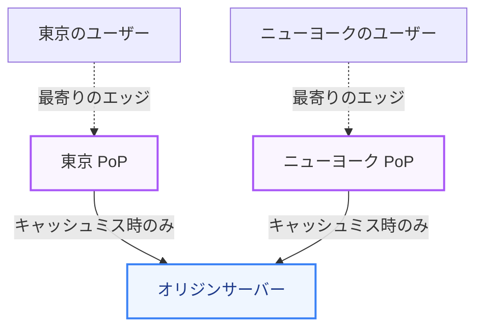

応答速度を向上させ、データベースやバックエンドサーバーの負荷を劇的に下げるための最も強力な手法の一つが **「キャッシング（Caching）」** です。また、地理的に近い場所から静的ファイルを届ける **「CDN（コンテンツ配信ネットワーク）」** もモダンなWebシステムには欠かせません。

第2章では、キャッシュの様々なパターン、データの整合性を維持するための戦略、および CDN のアーキテクチャについて学びます。

---

## 1. キャッシュの階層と分類

キャッシュとは、時間のかかる計算や遠くのデータベースから取得したデータを、一時的に高速に読み書きできるメモリ領域に保存しておく仕組みです。

### キャッシュの配置場所
1.  **クライアントキャッシュ (ブラウザキャッシュ)**
    *   HTTP ヘッダー (`Cache-Control`) を利用し、画像や JS/CSS などのアセットをブラウザ内に保存します。
2.  **CDN / エッジキャッシュ**
    *   世界各地に分散配置されたプロキシサーバーで静的・動的ファイルをキャッシュし、オリジンサーバーの手前でリクエストを処理します。
3.  **アプリケーションキャッシュ (ローカルメモリ)**
    *   Web サーバーのプロセス内メモリ（Node.js のオブジェクトメモリなど）にデータを一時保存します。高速ですが、サーバー間でデータが同期されないデメリットがあります。
4.  **分散キャッシュ (Redis / Memcached)**
    *   アプリケーションサーバーの外部に、メモリ型の専用データベースを構築します。複数のサーバー間で同一のキャッシュデータを安全に共有できます。

---

## 2. 代表的なキャッシュパターン（読み書き戦略）

データを読み書きする際、アプリケーション、キャッシュ、データベースの間でどのようなフローをとるべきかはシステム要件によって決まります。

### ① Cache-Aside（キャッシューアサイド）/ Lazy Loading
最も一般的で、実装が容易な読み取り戦略です。

*   **メリット**: キャッシュサーバーが一時的にダウンしても、DB に直接アクセスするためシステム全体は停止しない（障害耐性）。
*   **デメリット**: キャッシュミスが発生した最初のアクセスが遅くなる。また、DB の直接更新によるデータの不整合が発生しやすい。

### ② Write-Through（ライトスルー）
書き込み時、常にキャッシュとデータベースの両方に同時に書き込みます。

*   **フロー**: アプリ $\rightarrow$ キャッシュに書き込み $\rightarrow$ キャッシュが即座に DB に書き込み $\rightarrow$ 完了をアプリに通知。
*   **特徴**: キャッシュが常に最新に保たれ、読み取りが常に高速になりますが、書き込みの遅延（レイテンシ）は増加します。

### ③ Write-Behind（ライトビハインド）/ Write-Back
データをまずキャッシュにだけ書き込み、後から非同期でまとめてデータベースに書き込みます。

*   **フロー**: アプリ $\rightarrow$ キャッシュに書き込み $\rightarrow$ 即座に完了通知 $\rightarrow$ バックグラウンドで非同期に DB に一括書き込み。
*   **特徴**: 書き込みパフォーマンスが極めて高くなりますが、DB に反映される前にキャッシュサーバーがクラッシュすると、書き込みデータが消失するリスクがあります。

---

## 3. キャッシュ無効化と破棄ポリシー（Eviction）

キャッシュサーバーのメモリは有限です。容量がいっぱいになったとき、どのデータを破棄してメモリスペースを空けるかを決めるのが **「Eviction Policy（破棄ポリシー）」** です。

*   **LRU (Least Recently Used)**
    *   最も長い時間「参照されていなかった」古いデータを優先的に破棄します。キャッシュの実装で最も広く採用されています。
*   **LFU (Least Frequently Used)**
    *   「参照された回数」が最も少ないデータを優先的に破棄します。頻繁にアクセスされるホットキーを守るのに適しています。
*   **FIFO (First-In, First-Out)**
    *   参照回数に関係なく、「最初にキャッシュに入った」データを順番に破棄します。

また、データが古くなったまま残り続けるのを防ぐため、必ず **TTL（Time To Live: 生存時間）** を設定し、自動的に期限切れになるように設計するのが鉄則です。

---

## 4. CDN (Content Delivery Network) の仕組み

CDN は、インターネット上に分散配置されたサーバー群で構成され、静的コンテンツ（画像、動画、CSS、JS）をクライアントの物理的な位置に近い「エッジサーバー（PoP）」から配信します。

### CDN 導入のメリット
*   **応答時間の短縮**: クライアントからミリ秒単位の物理的距離でデータを配信できるため、ページの表示速度が大幅に向上します。
*   **オリジン負荷の大幅な削減**: リクエストの 90% 以上がエッジでキャッシュヒット（キャッシュオフロード）すれば、本番サーバーのスペックを抑えられます。
*   **DDoS攻撃対策**: 大量のトラフィックをエッジネットワーク全体で吸収・緩和させることが可能です。

---

## まとめ

*   キャッシュは **Cache-Aside** のような読み取りパターンや、データの整合性を担保する書き込み戦略（**Write-Through / Write-Behind**）をユースケースに応じて選定する。
*   メモリリークを防ぐため、**LRU** などの破棄ポリシーと適切な **TTL** の設定が必須。
*   **CDN** は物理的距離の遅延を解消し、オリジンの帯域や負荷を保護するための基盤技術である。
