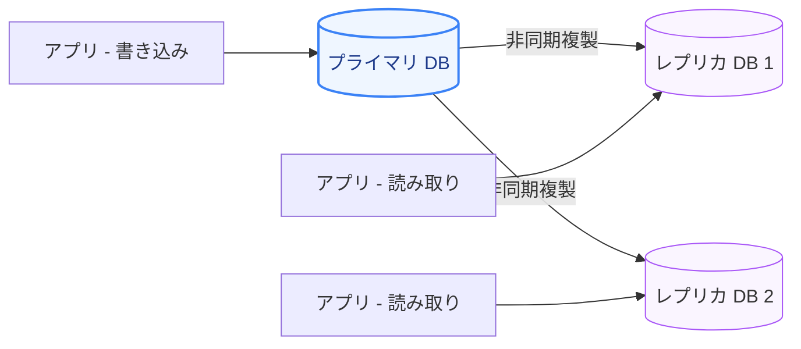
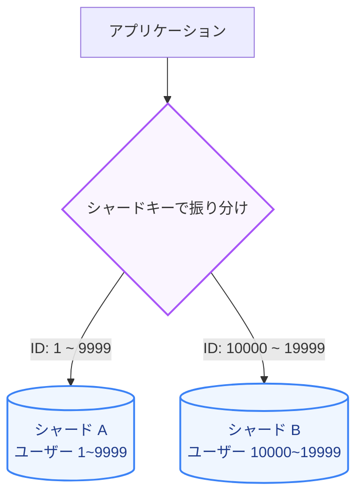

アプリケーションサーバーはステートレスに設計することで簡単に水平スケーリングできますが、データを保持する **「データベース（Database）」** は状態を持つ（ステートフルである）ため、スケーリングが最も困難なコンポーネントです。

第3章では、データベースの書き込みと読み込みをスケールさせる手法、および分散データストアを設計する上での物理限界を示す「CAP定理」について学びます。

---

## 1. 読み込みのスケーリング：レプリケーション

多くの Web アプリケーションでは、書き込み（Write）よりも読み取り（Read）の割合が圧倒的に多くなります。読み取りの負荷を分散させる一般的な手法が **「レプリケーション（Replication: 複製）」** です。

### プライマリ/レプリカ構成（Master/Slave）
*   **プライマリ（主）データベース**: すべての更新処理（INSERT / UPDATE / DELETE）を受け付けます。
*   **レプリカ（従）データベース**: プライマリから複製されたデータを保持し、読み取り（SELECT）処理のみを実行します。

### レプリカラグと整合性モデル
プライマリからレプリカへのデータ同期は、パフォーマンス向上のため通常 **非同期** で行われます。このため、プライマリに書き込まれてからレプリカに反映されるまでにタイムラグ（**レプリカラグ**）が生じます。

*   **強い整合性 (Strong Consistency)**: 書き込みが完了した直後に、どのノードから読み込んでも必ず最新のデータが取得できる。同期レプリケーションが必要となり遅延が増加する。
*   **最終整合性 (Eventual Consistency)**: 一時的にデータが古くなる可能性があるが、十分な時間が経過すれば、最終的にすべてのレプリカが同一データに同期する。非同期レプリケーションで得られる標準的な整合性モデル。

---

## 2. 書き込みのスケーリング：シャーディング

読み取り負荷はレプリカを増やすことで対応できますが、書き込み負荷がプライマリデータベースの処理限界を超えた場合は、データを複数の独立したデータベースに分割して保存する **「シャーディング（Sharding: 水平分割）」** が必要です。

### シャーディングのデータ分割方式
シャード間でデータをどのように分配するかを決めるのが **「シャードキー（Shard Key）」** です。

1.  **レンジベース (範囲検索ベース)**
    *   特定のID範囲（例：ユーザーID 1〜10000はシャードA、10001〜20000はシャードB）で分割します。実装は容易ですが、特定のシャードにデータが偏る（ホットスポット）問題が起きやすいです。
2.  **ハッシュベース (剰余演算等)**
    *   `Hash(UserId) % シャード数` のように、ハッシュ値を利用して均等にデータを分散させます。データは偏りにくいですが、シャードを後から追加する際のリバランス（データの再配置）が極めて複雑になります。

---

## 3. CAP定理の理解とデータストアの選定

分散データベースシステムを設計する上で、物理的なトレードオフの関係を示した有名な定理が **「CAP定理」** です。

分散システムにおいては、以下の3つの特性のうち、**同時に2つしか満たすことができない**とされています。

*   **Consistency (整合性)**: すべてのクライアントがどのノードにアクセスしても、同一の最新データを読み取れる。
*   **Availability (可用性)**: ノードが一部ダウンしていても、動作しているノードは必ず応答を返せる（エラーやタイムアウトを返さない）。
*   **Partition Tolerance (分断耐性)**: ノード間の通信ネットワークが寸断（パーティション）されても、システムが動作し続けられる。

実際、ネットワークは物理的に必ず障害が起こる（寸断される）可能性があるため、現実の分散システム設計においては **「P (分断耐性) は必須」** となり、**「C（整合性）を取るか、A（可用性）を取るか」** の二者択一を迫られます。

| システムタイプ | 特徴と障害時の挙動 | 代表的な技術 |
| :--- | :--- | :--- |
| **CP システム** (整合性 + 分断耐性) | ネットワーク分断時、データの一貫性を守るために、同期できないノードへの書き込み/読み込みを拒否（エラーを返す）する。 | PostgreSQL (強同期構成), MongoDB, Redis, HBase |
| **AP システム** (可用性 + 分断耐性) | ネットワーク分断時でも、各ノードは手元の古いかもしれないデータをそのまま返し、稼働し続ける。分断復旧後にデータをマージする。 | Cassandra, DynamoDB, CouchDB |

---

## まとめ

*   データベースの読み込み負荷は **レプリケーション**（プライマリ/レプリカ）によってスケールさせ、**最終整合性**モデルを受け入れることでスケーラビリティを最大化する。
*   データベースの書き込み負荷が限界に達した場合は **シャーディング**（水平分割）を行うが、データ移行やジョインの難易度が大きく向上する。
*   分散データ設計の際は **CAP定理** に則り、システムが「C（整合性）」と「A（可用性）」のどちらを重視すべきか、ビジネス要件に基づいて冷静に判断する。
