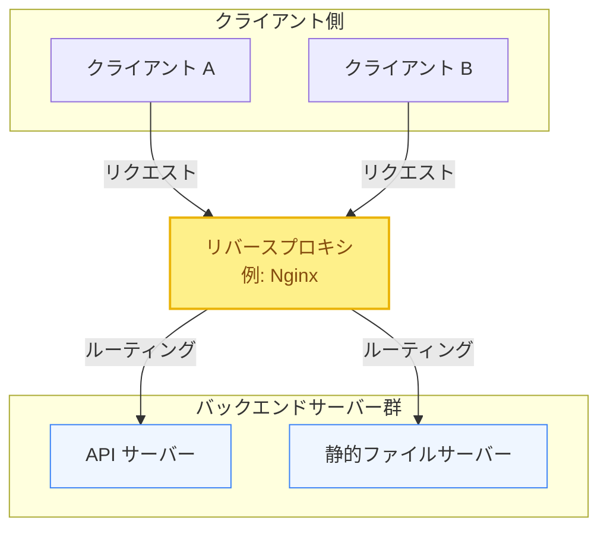
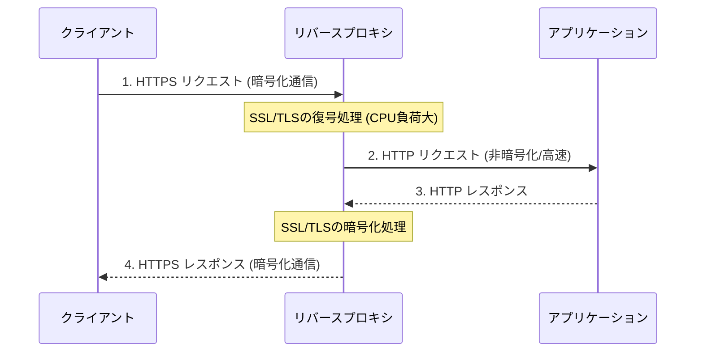

大規模なWebアプリケーションを安定して運用するためには、サーバー単体の性能向上だけでなく、サーバーの前面に配置する仲介サーバーの設計が重要になります。

第4章では、リクエストを受け取る窓口となる **「ロードバランサ（Load Balancer）」** と **「リバースプロキシ（Reverse Proxy）」** の違い、およびリバースプロキシが果たす多様な役割について学びます。

---

## 1. ロードバランサ vs リバースプロキシ

どちらもクライアントとサーバーの間に位置してトラフィックを制御しますが、その「主たる目的」に違いがあります。

| 比較項目 | ロードバランサ（LB） | リバースプロキシ（RP） |
| :--- | :--- | :--- |
| **主な目的** | トラフィックを複数のバックエンドサーバーに分散し、可用性とスケーラビリティを向上させる。 | クライアントからのリクエストを仲介し、セキュリティ、キャッシュ、SSL処理などの付加価値を提供する。 |
| **分散対象** | 通常、同一機能を持つ複数のサーバー群。 | 単一のサーバーの場合もあれば、異なる機能を持つ複数のサーバー（API、静的配信など）の場合もある。 |
| **代表的な位置づけ** | システムの最前面（DNSの直後など）に配置され、複数のリバースプロキシやWebサーバーへ振り分ける。 | Webサーバー（Appサーバー）の直前に配置され、細かなリクエスト制御や前処理を行う。 |

> [!NOTE]
> 現代のコンポーネント（例: Nginx, AWS ALB）は、**リバースプロキシでありながらロードバランサの機能も兼ね備えている** ことが多いため、境界線は曖昧になりつつあります。しかし、設計コンセプトとしての役割の違いを理解することは非常に重要です。

---

## 2. リバースプロキシとは？（フォワードプロキシとの違い）

プロキシ（代理）には、「フォワードプロキシ」と「リバースプロキシ」の2種類が存在します。

### フォワードプロキシ (Forward Proxy)
*   **役割**: **クライアント側**を代理します。社内ネットワークなどからインターネットへアクセスする際、クライアントの身元（IPアドレス）を隠したり、危険なサイトへのアクセスをフィルタリングしたりします。

### リバースプロキシ (Reverse Proxy)
*   **役割**: **サーバー側**を代理します。インターネットからのアクセスを代表して受け取り、適切なバックエンドサーバーへリクエストを転送します。クライアント側はバックエンドサーバーの存在を意識しません。

---

## 3. リバースプロキシの重要な役割

単にリクエストを右から左へ流すだけでなく、リバースプロキシはWebシステムのパフォーマンスやセキュリティを高めるために以下の重要な役割を担います。

### ① セキュリティと隠蔽
バックエンドのアプリケーションサーバー（Node.js, Go, Pythonなど）をインターネットに直接公開すると、OSやランタイムの脆弱性を突かれるリスクが高まります。リバースプロキシを前面に置くことで、バックエンドサーバーの実際のIPアドレスを隠蔽し、直接の攻撃を防ぐ壁として機能させます。

### ② SSL/TLS終端 (SSL Termination)
HTTPS通信の暗号化・復号処理（SSLハンドシェイクなど）は、CPU負荷の高い処理です。
リバースプロキシでSSL/TLSを復号（終端）し、リバースプロキシとバックエンドサーバー間は高速なHTTP（暗号化なし、または簡易暗号化）で通信することで、アプリケーションサーバーのCPUリソースをビジネスロジックの実行に集中させることができます。

### ③ 静的コンテンツの高速配信とキャッシュ
HTML, CSS, JavaScript, 画像などの静的ファイルは、アプリケーションサーバー（Node.jsなど）で処理するよりも、C言語等で極限まで最適化されたリバースプロキシ（Nginxなど）から直接ディスク読み出し・キャッシュ配信するほうが圧倒的に高速かつ低リソースで処理できます。

### ④ バッファリングと圧縮
*   **バッファリング**: 遅い回線のクライアントからの接続をリバースプロキシが肩代わりし、レスポンスデータを一時的にバッファ（メモリ/ディスク）に溜めてからクライアントに少しずつ送ります。これにより、バックエンドサーバーは瞬時に処理を完了して次のリクエストに備えられます。
*   **圧縮**: クライアントにデータを返却する前に、Gzip や Brotli アルゴリズムを用いてデータを圧縮し、ネットワーク帯域を節約します。

---

## まとめ

*   **ロードバランサ**は「負荷の均等分散」、**リバースプロキシ**は「セキュリティ向上、SSL終端、静的ファイル配信などの前処理・最適化」が主目的である。
*   **SSL終端**によって、重い暗号化処理をプロキシに集約し、バックエンドのCPU負荷を大幅に削減できる。
*   Nginx などのリバースプロキシは、静的ファイルの高速配信やレスポンスバッファリングを行い、システム全体の応答性能を高めている。
