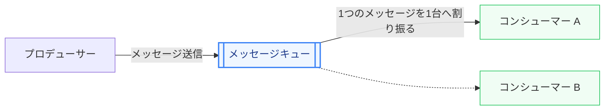
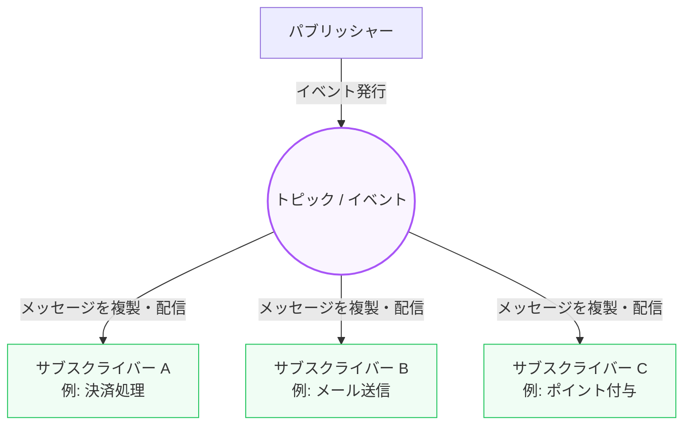

システムが大きくなり、多くのマイクロサービスやバックエンド処理が連携するようになると、サービス間の通信方法が全体のパフォーマンスと信頼性を左右するようになります。

第5章では、システムを疎結合にし、急激なアクセス（スパイク）からデータベースを守るための **「非同期メッセージング（メッセージキューとPub/Sub）」** の仕組みとメリットについて学びます。

---

## 1. 同期通信 vs 非同期通信

システム間の連携方法は、大きく「同期通信」と「非同期通信」に分類されます。

### 同期通信 (Synchronous)
クライアントがリクエストを送信した後、サーバーが処理を完了してレスポンスを返すまで **待機（ブロック）** する通信方式です（例: HTTP REST API, gRPC）。
*   **メリット**: 結果が即座にわかるため、実装やデータの整合性管理がシンプル。
*   **デメリット**: 呼び出し先のサービスがダウンしていると、呼び出し元もエラーになる（障害の連鎖）。呼び出し先が遅いと全体の応答速度が低下する。

### 非同期通信 (Asynchronous)
リクエスト（メッセージ）をメッセージブローカーに預け、受信完了の通知を受け取ったら、実際の処理の完了を **待たずに次の処理へ進む** 方式です。
*   **メリット**: 呼び出し先が一時停止していてもシステム全体が止まらない。時間のかかる重い処理をバックグラウンドに回せる。
*   **デメリット**: 結果が即座に確定しないため、「最終的な整合性（Eventual Consistency）」を意識した設計が必要。

---

## 2. メッセージキュー (Message Queue) の仕組み

メッセージキューは、**「Point-to-Point（1対1）」** の通信パターンを採用した非同期通信の仕組みです。

*   **プロデューサー (Producer)**: 処理要求（メッセージ）を作成し、キューに送信する側。
*   **キュー (Queue)**: メッセージを一時的に保持するバッファ。コンシューマーが受け取るまでメッセージを保持し続けます。
*   **コンシューマー (Consumer)**: キューからメッセージを取り出して処理を実行する側。
*   **特徴**: **ひとつのメッセージは、必ずひとつのコンシューマーによってのみ処理されます。** コンシューマーの数を増やす（水平スケールする）ことで、キューに溜まったメッセージを並列で高速に消化できます（競合コンシューマーパターン）。
*   **代表例**: AWS SQS, RabbitMQ

---

## 3. Pub/Sub (パブリッシュ/サブスクライブ) の仕組み

Pub/Subは、**「1対多（ブロードキャスト）」** の通信パターンを採用したイベント駆動型のメッセージングです。

*   **パブリッシャー (Publisher)**: メッセージを特定の受信者を意識せず、**トピック（Topic）** と呼ばれるチャンネルに対して発行（Publish）します。
*   **サブスクライバー (Subscriber)**: 興味のあるトピックを購読（Subscribe）しておき、トピックにメッセージが流れると自動的にそれを受け取って処理します。
*   **特徴**: **同一のメッセージが、そのトピックを購読しているすべてのサブスクライバーに送信されます。** 送信側と受信側はお互いの存在を全く知らないため、極めて疎結合になります。
*   **代表例**: Apache Kafka, AWS SNS, Google Cloud Pub/Sub, AWS EventBridge

---

## 4. メッセージング導入の3大メリット

### ① スパイク対策と負荷平滑化（バッファリング）
ECサイトのセール開始直後など、短時間に大量のアクセスが集中（スパイク）した際、リクエストのたびに重い処理（PDF領収書生成など）やデータベース書き込みを直接行うと、接続数が限界に達してサーバーがクラッシュします。
リクエストを一旦キューに保存することで、バックエンドのコンシューマーは自身が処理可能なスピード（マイペース）で順次メッセージを消化でき、システム全体のクラッシュを防ぐことができます。

### ② システムの疎結合化（デカップリング）
例えば「ユーザー登録」が行われた際、「メール送信」「ポイント付与」「外部CRMへの同期」という処理が必要だとします。
これらを同期通信で連鎖させると、どれか1つが失敗しただけでユーザー登録全体がエラーになります。
Pub/Subを導入し、「ユーザーが登録された」というイベントをトピックに投げるだけにすれば、各処理は独立して実行され、後から「LINE通知機能」などを追加する際もユーザー登録処理本体のコードを修正する必要がありません。

### ③ 耐障害性の向上（メッセージの永続化）
バックエンドサーバー（コンシューマー）にバグが発生し、一時的に停止してしまった場合でも、メッセージキューにメッセージが安全に保持されます。バグを修正してコンシューマーを再起動すれば、停止していた時間帯のメッセージから再開し、データを1件も損失することなく処理を再完了させることができます。

---

## まとめ

*   **同期通信**は呼び出し先の完了を待つが、**非同期通信**はメッセージブローカーにリクエストを預けて即座に次に進む。
*   **メッセージキュー（Point-to-Point）** は1つのメッセージを1つのコンシューマーが処理する（負荷分散向き）。
*   **Pub/Sub** は1つのメッセージを複数の異なるサブスクライバーへ配信する（イベント駆動・マイクロサービス連携向き）。
*   非同期通信によって、システムの**疎結合化（デカップリング）**、**スパイク時の負荷平滑化（バッファリング）**、**耐障害性の向上**が実現できる。
