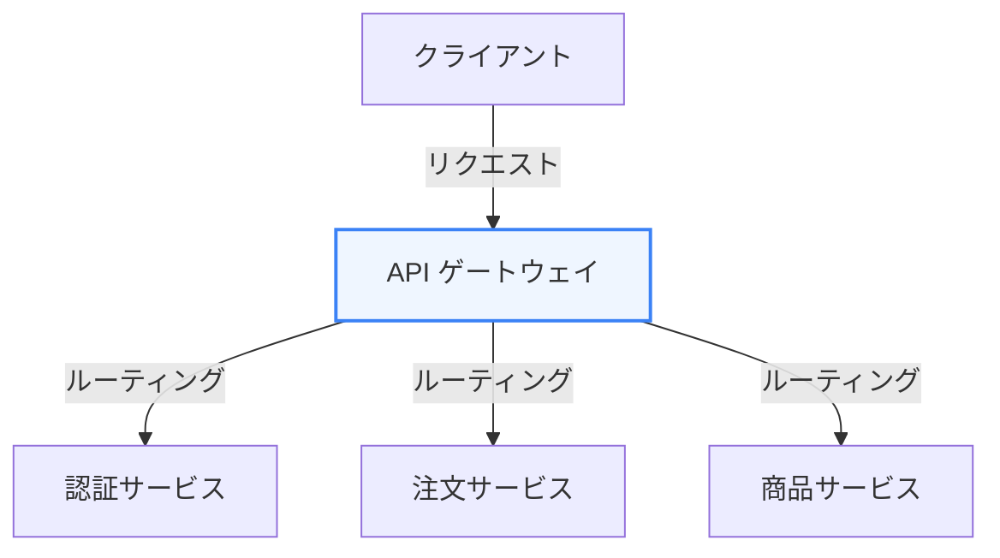
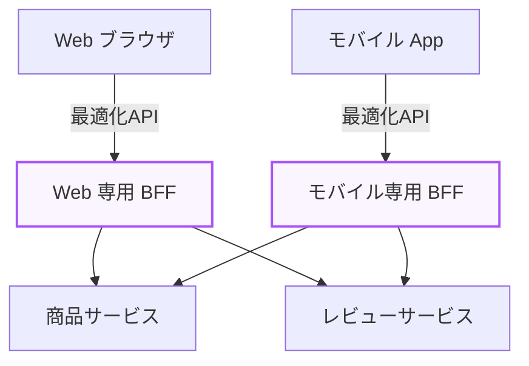

マイクロサービスアーキテクチャの進展に伴い、クライアントと各バックエンドサービス間の通信をどのように整理するかが非常に重要になってきました。

第6章では、複数のマイクロサービスへのアクセスを統合する **「APIゲートウェイ」** と、特定のフロントエンド向けにAPIを最適化する **「BFF（Backend For Frontend）」** について学びます。

---

## 1. APIゲートウェイとは？

APIゲートウェイは、システム外部のクライアントからのリクエストをすべて受け取り、適切なバックエンドのマイクロサービスへルーティングする **「単一のエントリーポイント（リバースプロキシ）」** です。

### 主な役割と機能
*   **認証・認可 (Authentication & Authorization)**: 各マイクロサービスで個別に認証を行うのではなく、ゲートウェイで一括してトークン検証（JWTなど）を行います。
*   **ルーティング (Routing)**: `/api/v1/products` は商品サービスへ、`/api/v1/orders` は注文サービスへ、といったパスベースの振り分けを行います。
*   **レート制限 (Rate Limiting)**: 特定のクライアントからの過剰なアクセスを遮断し、バックエンドを保護します。
*   **ロギング・監視 (Observability)**: システム全体の入り口として、トラフィックのログを一元的に記録します。

---

## 2. APIゲートウェイの課題

APIゲートウェイは非常に便利ですが、システムが複雑化し、さまざまなクライアント（PC Web、モバイルアプリ、スマートウォッチ等）が登場すると、以下の課題が生じます。

1.  **データの過不足 (Over-fetching / Under-fetching)**: 画面の小さいモバイルアプリでは少量のデータで十分なのに、PC Web向けに設計されたAPIゲートウェイは大量のデータ（オーバースペックなJSON）を返してしまう。
2.  **ラウンドトリップの増加**: 1つの画面を表示するのに、クライアントが複数のAPI（商品、レビュー、推奨）を個別に呼び出す必要があり、低帯域なモバイル環境で表示速度が低下する。
3.  **ゲートウェイの肥大化**: あらゆるクライアントの要望を1つのAPIゲートウェイで満たそうとすると、共通ゲートウェイのコードが肥大化し、開発のボトルネックになります。

---

## 3. BFF (Backend For Frontend) パターン

上記の課題を解決するために考案されたのが、**BFF（Backend For Frontend）パターン** です。
BFFは、共通のAPIゲートウェイを持つ代わりに、**「フロントエンド（クライアント）のタイプごとに専用の中間サーバーを用意する」** 設計手法です。

### BFFがもたらすメリット
*   **APIの集約 (API Composition)**: BFFがバックエンドの複数サービスからデータを並行して取得し、クライアントが求める形に1つのレスポンスとしてマージします。クライアント・BFF間の通信は1回で済みます。
*   **データフォーマットの最適化**: モバイル向けには不要なフィールドを削除し、画像の解像度を下げたURLを返却するなど、ペイロードサイズを極小化できます。
*   **フロントエンド開発者への権限委譲**: BFFのコードはフロントエンド開発チームが管理・開発することが多いため、UIの変更に伴うAPIの調整をバックエンドチームに依頼することなく自己完結できます（BFFをNode.jsやGraphQLで実装するのが一般的です）。

---

## まとめ

*   **APIゲートウェイ** は、認証やレート制限、ルーティングといった共通処理をエッジで一元管理するリバースプロキシ。
*   **BFF** は、クライアントの種類ごとに個別に用意される中間API層。
*   BFFを導入することで、クライアントのネットワーク負荷を劇的に減らし、UI開発のスピードとパフォーマンスを最大化できる。
