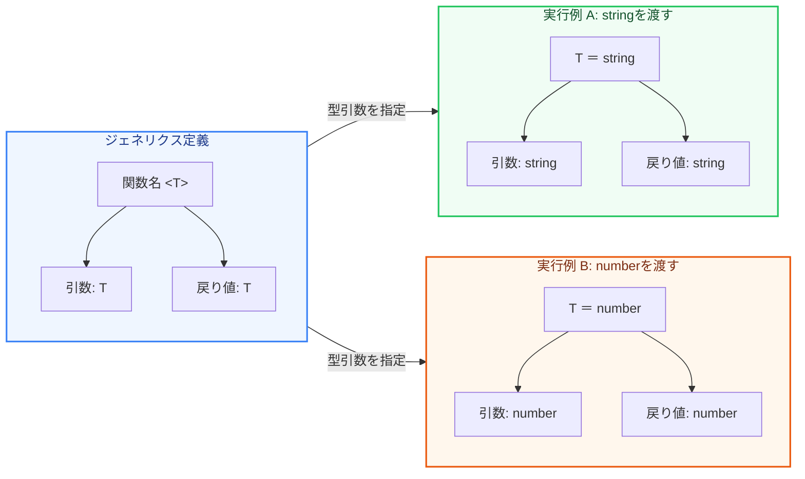

TypeScriptでコンポーネントや関数を設計するとき、特定の型に依存せず、かつ型安全性を保ったまま再利用したいケースが多々あります。

この「型をパラメータ（引数）として扱う仕組み」を **ジェネリクス（Generics：総称型）** と呼びます。

第2章では、ジェネリクスの基礎から、実用的な使い方までを図解で分かりやすく学びます。

---

## 1. ジェネリクスとは？

ジェネリクスは、関数やクラス、インターフェースを定義する際に、具体的な型（`string` や `number` など）をあらかじめ決めず、**使うときに外から型を引数として渡す** 仕組みです。



---

## 2. なぜジェネリクスが必要なのか？

例えば、「引数をそのまま返す関数（アイデンティティ関数）」を作るとします。

### ✕ 悪い例：any を使う
`any` を使うと、どんな型でも受け取れますが、型チェックが機能しなくなり、戻り値の型も `any` になってしまいます。

```typescript
function identity(arg: any): any {
  return arg;
}

const result = identity("Hello"); // result は any 型（エディタの支援が効かない）
```

### ◯ 良い例：ジェネリクスを使う
`<T>` を定義することで、渡された引数の型を記憶し、戻り値にもその型を伝播させます（`T` は Type の頭文字で、任意のアルファベットが使えます）。

```typescript
// T という型パラメータを持つ関数
function identity<T>(arg: T): T {
  return arg;
}

// 呼び出すときに明示的に型を指定する
const result1 = identity<string>("Hello"); // result1 は string 型
const result2 = identity<number>(100);     // result2 は number 型

// 型推論により、型指定を省略することも可能（コンパイラが自動的に判断する）
const result3 = identity(true);            // result3 は boolean 型
```

---

## 3. 実用的なユースケース：APIのレスポンス

ジェネリクスは、APIからデータを取得する際の共通ハンドラーなどで非常によく使われます。レスポンスの共通構造（`data`, `error` など）を維持したまま、中身の型を動的に定義できます。

```typescript
// 共通のレスポンス構造を定義
interface ApiResponse<T> {
  data: T;
  status: number;
  success: boolean;
}

// 具体的なデータの型
interface User {
  id: number;
  name: string;
}

interface Post {
  id: number;
  title: string;
}

// 使うときに型を流し込む
const userResponse: ApiResponse<User> = {
  data: { id: 1, name: "Handi" },
  status: 200,
  success: true,
};

const postResponse: ApiResponse<Post> = {
  data: { id: 101, title: "Next.js入門" },
  status: 200,
  success: true,
};
```

---

## 4. ジェネリクスに制約をつける（extends）

何でも受け入れられるジェネリクスですが、時には「特定のプロパティを持っている型だけに制限したい」という場合があります。その際は `extends` を使って制約を加えます。

```typescript
// lengthプロパティを持つオブジェクトであることを強制する制約
interface Lengthwise {
  length: number;
}

function logLength<T extends Lengthwise>(arg: T): T {
  console.log(arg.length); // lengthが存在することが保証されるため安全にアクセスできる
  return arg;
}

logLength("Hello");          // 文字列は length を持つので OK
logLength([1, 2, 3]);        // 配列は length を持つので OK
logLength({ length: 10, value: "test" }); // OK

logLength(100);              // エラー！数値は length を持たない
```

---

## まとめ

*   **ジェネリクス** は、コードを再利用しつつ型安全性を担保するための仕組み。
*   `<T>` などの型パラメータを定義し、呼び出し時に具体的な型をバインドする。
*   `any` を排除しつつ、柔軟な共通化（APIレスポンスのラッパーなど）を安全に実装できる。
*   `extends` キーワードを用いて、受け取れる型に **制約** を設定することが可能。
