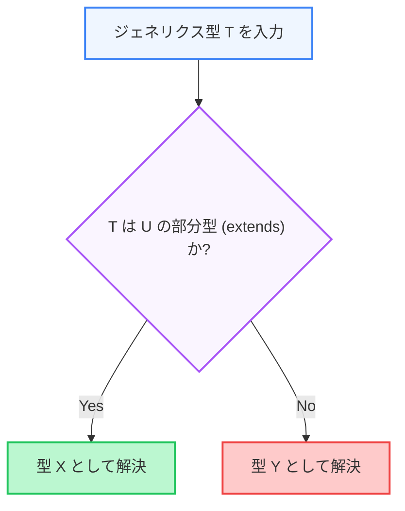

TypeScriptの型システムは「静的な型定義」に留まらず、プログラムの論理に基づいて柔軟に型を変化・生成させることができる「プログラミング言語」のような機能を持っています。本章では、型安全性を極限まで高めるための高度な機能である **`Conditional Types`**、**`Mapped Types`**、および **`Template Literal Types`** を解説します。

---

## 1. Conditional Types（条件付き型）

Conditional Types は、三項演算子（`T extends U ? X : Y`）のような構文を用いて、型が別の型を「継承（extends）しているか」に基づいて動的に型を分岐させる仕組みです。

```typescript:conditional-basic.ts
// T が string であれば string[] を、そうでなければ number[] を返す
type ArrayOrString<T> = T extends string ? string[] : number[];

type A = ArrayOrString<string>; // string[]
type B = ArrayOrString<number>; // number[]
type C = ArrayOrString<boolean>; // number[]
```

### Conditional Types の型解決フロー（図解）



### 応用例：関数の引数による戻り値の動的切り替え
API通信において、特定のステータスが成功であるか失敗であるかに応じて、レスポンスの型を切り替える例です。

```typescript:api-conditional.ts
interface SuccessResponse {
  status: "success";
  data: { id: number; name: string };
}

interface ErrorResponse {
  status: "error";
  message: string;
}

// 渡されたステータスリテラル型に基づいて、レスポンス型を切り替える
type ApiResponse<T extends "success" | "error"> = T extends "success"
  ? SuccessResponse
  : ErrorResponse;

function handleResponse<T extends "success" | "error">(status: T): ApiResponse<T> {
  // 実装コードは省略
  throw new Error();
}

const success = handleResponse("success"); // SuccessResponse 型と推論される
const failure = handleResponse("error");   // ErrorResponse 型と推論される
```

---

## 2. Mapped Types（マッピングされた型）

Mapped Types は、既存の型（オブジェクトやユニオン型）のすべてのキーをループ処理して、新しいオブジェクト型を生成する仕組みです。

```typescript:mapped-basic.ts
type Features = {
  search: boolean;
  filter: boolean;
};

// Features のすべてのキーの値を string 型に変換する
type DescriptionOf<T> = {
  [K in keyof T]: string;
};

type FeatureDescriptions = DescriptionOf<Features>;
// 結果:
// {
//   search: string;
//   filter: string;
// }
```

### 修飾子（`+`, `-`, `?`, `readonly`）の制御
Mapped Types では、プロパティを「読み取り専用 (`readonly`)」にしたり、「オプショナル (`?`)」にしたりする修飾子を、追加（`+`）または削除（`-`）することができます。

```typescript:mapped-modifiers.ts
type User = {
  readonly id: string; // 変更不可
  name?: string;       // オプショナル
};

// readonly と ? を完全に排除して、すべて必須・変更可能な型を生成する
type Concrete<T> = {
  -readonly [K in keyof T]-?: T[K]; // -readonly で readonly を除去、-? でオプショナルを除去
};

type AbsoluteUser = Concrete<User>;
// 結果:
// {
//   id: string;   (readonlyではない)
//   name: string; (オプショナルではない)
// }
```

---

## 3. Template Literal Types（テンプレートリテラル型）

ES6 のテンプレートリテラルに似た構文で、文字列リテラル型を組み合わせて新しい文字列型を動的に生成する機能です。

```typescript:template-literal.ts
type Direction = "top" | "right" | "bottom" | "left";
type MarginProperty = `margin-${Direction}`;

// 結果の型: "margin-top" | "margin-right" | "margin-bottom" | "margin-left"
const myMargin: MarginProperty = "margin-top";
```

これを利用すると、CSSクラス名やアクションタイプ名などのパターンを厳密に型安全に縛り上げることができます。

---

## まとめ

*   **`Conditional Types`** (`T extends U ? X : Y`) は、条件分岐によって型を動的に切り替える。
*   **`Mapped Types`** (`[K in keyof T]`) は、既存のオブジェクト型のキーを再利用して新しい型を作る。
*   **`Template Literal Types`** は、文字列型同士を合成してパターンに基づいた厳格な型を作成する。
