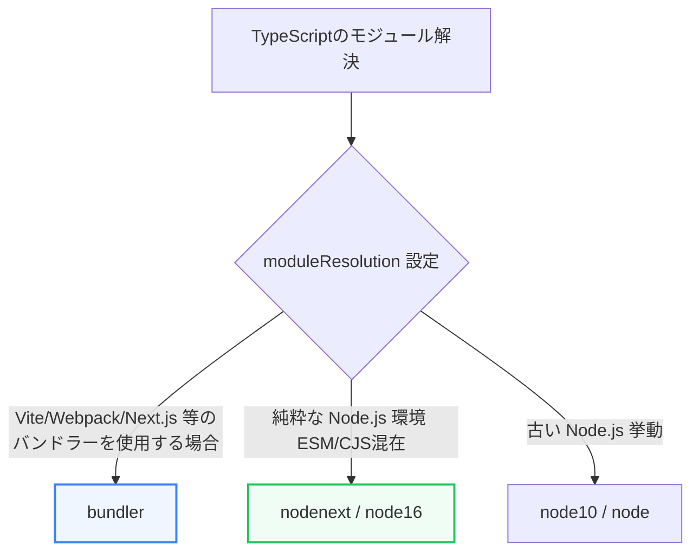

TypeScriptプロジェクトの頭脳であり、コンパイラ（`tsc`）の挙動を決定づけるのが **`tsconfig.json`** です。この設定ファイルのオプション、特にモジュールをどのように解決するかという **「モジュール解釈（Module Resolution）」** の理解は、環境構築時のコンパイルエラーを回避するために極めて重要です。

第5章では、`tsconfig.json` の主要オプションとモジュールシステムへの適合について学びます。

---

## 1. tsconfig.json の主要オプション

TypeScriptを導入する際、最も重要とされる主要な設定項目です。

* **`target`**:
  * TypeScriptコードをどのバージョンのJavaScriptにコンパイル（変換）するかを指定します（例: `ES2022`, `ESNext`）。
* **`lib`**:
  * コンパイル時に利用可能な組み込みAPIの型定義をコンパイラに伝えます（例: ブラウザ環境であれば `["DOM", "ES2022"]`）。
* **`strict`**:
  * `true` にすることで、`noImplicitAny`（暗黙的なanyの禁止）や `strictNullChecks`（厳密なnullチェック）など、すべての厳格な型チェック機能が一括で有効化されます。製品の品質を保つために **必須** の設定です。

---

## 2. ESModules vs CommonJS とモジュール解釈

JavaScriptには歴史的に2つのモジュールシステムが存在します。

* **CommonJS (CJS)**: `require()` / `module.exports` （旧来のNode.js標準）
* **ESModules (ESM)**: `import` / `export` （ブラウザ標準およびモダンNode.js標準）

これらが混在したプロジェクトや、外部ライブラリをロードする際、コンパイラがファイルを正しく探索・解釈できるようにするのが **`moduleResolution`** オプションです。



* **`node` (または `node10`)**: 古いNode.jsの解決方法です。フォルダ内の `index.ts` や拡張子の省略を許容します。
* **`nodenext` / `node16`**: モダンなNode.jsの動作を再現します。`package.json` の `"type": "module"` や `"exports"` フィールドによる正確なサブパス解決に対応し、相対パスのインポート時に拡張子（`.js`）の明示が必要になります。
* **`bundler`**: WebpackやVite、Next.jsなどの外部バンドラーの利用を前提とした設定です。拡張子の省略や、Node.js仕様のモジュール探索を適切に両立します。

---

## 3. パスエイリアスと型定義ファイル

### パスエイリアス (`paths`)
相対パスの階層が深くなったときの `../../../../components/Button` のようなネスト（相対パス地獄）を解消し、プロジェクトのルートからの絶対パス風に記述できるようにする機能です。

```json:tsconfig.json
{
  "compilerOptions": {
    "baseUrl": ".",
    "paths": {
      "@/*": ["src/*"]
    }
  }
}
```
これにより、どこからでも `import { Button } from '@/components/Button'` のように美しくインポートできます。

### 型定義ファイル (`.d.ts`)
JavaScriptで書かれたライブラリに対して、TypeScriptから型情報を提供するためのファイルです。
* **アンビエント宣言 (`declare`)**: `declare module 'some-js-library'` と記述することで、型定義が存在しない古いJavaScriptライブラリに対しても、一時的にエラーを回避させて型を当てることができます。
