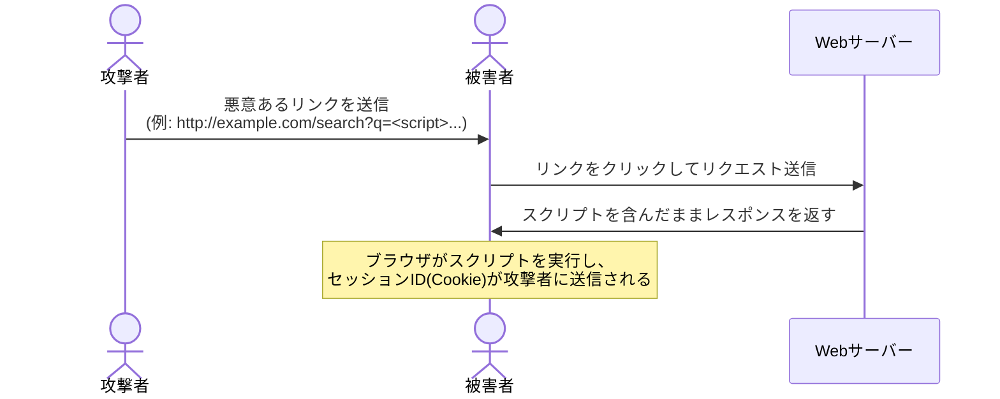
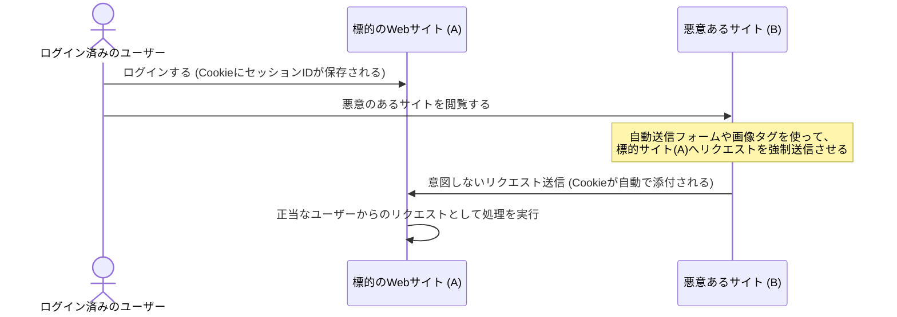

Webアプリケーションを構築する上で、避けて通れないのがセキュリティ対策です。本章では、代表的なWeb脆弱性である **XSS（クロスサイトスクリプティング）** と **CSRF（クロスサイトリクエストフォージェリ）** について、その仕組みと具体的な防衛策を学びます。

---

## 1. XSS（Cross-Site Scripting）

XSSは、悪意のあるユーザーがWebサイトに不正なスクリプトを注入し、他のユーザーのブラウザ上でそれを実行させる脆弱性です。

### 種類
1. **反射型XSS (Reflected XSS)**: URLのパラメータなどに含まれる悪意あるスクリプトが、サーバーを介してそのままブラウザに返されて実行される形式。
2. **格納型XSS (Stored XSS)**: 掲示板やプロフィール画面など、データベースに保存された不正スクリプトが、他のユーザーがそのページを閲覧した際に実行される形式（最も危険）。
3. **DOM-based XSS**: サーバーを経由せず、JavaScriptが不適切にURLパラメータなどをパースして直接画面に出力（`innerHTML` 等を使用）することで発生する形式。

### 反射型XSSの攻撃フロー（図解）



### XSSの対策

1. **エスケープ（サニタイズ）の徹底**:
   ユーザーからの入力値を画面に出力する際は、HTMLタグとして解釈されないよう、特別な文字（`<`, `>`, `&`, `"`, `'`）をHTMLエンティティに変換します。

```typescript:escape.ts
function escapeHtml(str: string): string {
  return str
    .replace(/&/g, '&amp;')
    .replace(/</g, '&lt;')
    .replace(/>/g, '&gt;')
    .replace(/"/g, '&quot;')
    .replace(/'/g, '&#x27;');
}
```

2. **ReactやNext.jsなどのフレームワークの使用**:
   ReactはデフォルトでJSX内の変数を自動エスケープします。ただし、`dangerouslySetInnerHTML` を使用する場合は自動エスケープが無効化されるため、十分な注意が必要です。

---

## 2. CSRF（Cross-Site Request Forgery）

CSRFは、ユーザーがログイン済みのWebサイトに対して、外部の悪意あるサイトから意図しないリクエスト（パスワード変更、購入処理など）を強制的に送信させる攻撃手法です。

### 攻撃フロー（図解）



### CSRFの対策

1. **Cookieの SameSite 属性を設定する**:
   SameSite属性を設定することで、サードパーティ（別のドメイン）からの遷移やリクエスト時にセッションCookieが送信されるのを防ぎます。
   - `Strict`: 同一ドメインからのリクエストにのみCookieを送信（最も厳格）。
   - `Lax`: 通常のリンク遷移（GETリクエスト）以外では外部ドメインからのCookie送信をブロック（モダンブラウザのデフォルト）。
   - `None`: 制限なし（HTTPS必須）。

```typescript:cookie.ts
// ExpressなどでのCookie設定例
res.cookie('sessionId', 'token_value', {
  httpOnly: true, // JavaScriptからのアクセスを禁止 (XSS対策)
  secure: true,   // HTTPS通信でのみ送信
  sameSite: 'lax' // CSRF対策
});
```

2. **CSRFトークンの検証**:
   リクエスト（POST, PUT等）を送信する際、クライアント側にワンタイムトークンを発行しておき、サーバー側で受信したトークンとセッション内に保持しているトークンが一致するかを検証します。外部サイトからのリクエストにはこのトークンを含めることができないため、攻撃を防ぐことができます。

---

## まとめ

*   **XSS** は「自サイトの画面に他人のスクリプトを実行させる」攻撃。対策は **HTMLエスケープ**。
*   **CSRF** は「他人のサイトから自サイトへリクエストを強制する」攻撃。対策は **SameSite属性** と **CSRFトークン**。
