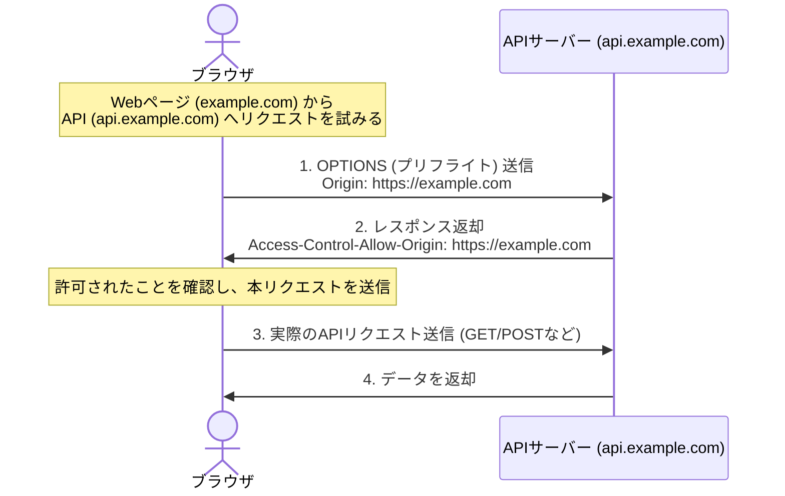

モダンWebブラウザには、セキュリティを維持しつつ異なるオリジン間で安全にリソースを共有・制限するための仕組みが備わっています。本章では、特に重要な **CORS（オリジン間リソース共有）** と **CSP（コンテンツセキュリティポリシー）** について解説します。

---

## 1. CORS（Cross-Origin Resource Sharing）

ブラウザには本来、あるサイト（オリジン）から読み込まれたスクリプトが、異なるオリジンのリソースにアクセスすることを制限する **同一起源ポリシー（Same-Origin Policy）** があります。
**CORS** は、サーバーが特定のオリジンに対してのみ「リソースへのアクセスを許可する」と明示することで、安全にこの制限を緩和する仕組みです。

*   **オリジン (Origin)** とは: `プロトコル` + `ホスト名（ドメイン）` + `ポート番号` の組み合わせです。
    - `https://example.com:443` と `http://example.com:443` は異なるオリジン（プロトコルが違う）
    - `https://api.example.com` と `https://example.com` は異なるオリジン（ホストが違う）

### プリフライトリクエスト (Preflight Request)

ブラウザは、データを書き換える可能性のあるリクエスト（`POST` や `DELETE`、あるいはカスタムヘッダーを持つ `GET`）を送信する前に、まず **`OPTIONS` メソッド** を使った「事前問い合わせ（プリフライト）」を送信し、通信が許可されているかを確認します。



### CORSエラーが発生した場合の対策

CORSエラーは **ブラウザがアクセスを遮断した** ことで発生します。そのため、クライアント側ではなく、アクセス先の **サーバー側** で正しいレスポンスヘッダーを返すように設定する必要があります。

```typescript:cors-middleware.ts
// Node.js (Express) でのCORS設定例
import express from 'express';
import cors from 'cors';

const app = express();

const corsOptions = {
  origin: 'https://example.com', // 許可するオリジンを指定 (ワイルドカード '*' はCookieを使用する場合不可)
  methods: 'GET,POST,PUT,DELETE',
  allowedHeaders: 'Content-Type,Authorization',
  credentials: true // Cookieなどの資格情報を許可
};

app.use(cors(corsOptions));
```

---

## 2. CSP（Content Security Policy）

**CSP** は、ブラウザが読み込みおよび実行を許可するリソース（JavaScript、CSS、画像、フレームなど）のホワイトリストを、Webサーバーがヘッダーを通じて指定するセキュリティ機能です。これにより、XSSなどで悪意あるスクリプトが注入された場合でも、その実行をブラウザ側で防ぐことができます。

### CSPヘッダーの設定例

```http:response-header
Content-Security-Policy: default-src 'self'; script-src 'self' https://trustedscripts.com; img-src 'self' data:;
```

*   `default-src 'self'`: すべてのリソースのデフォルトは、現在のオリジン（自サイト）からのみ許可します。
*   `script-src 'self' https://trustedscripts.com`: JavaScriptの読み込み元は、自サイトと `trustedscripts.com` のみに制限します。インラインスクリプト（HTML内に直接書かれた `<script>...</script>`）は原則として実行が禁止されます。
*   `img-src 'self' data:`: 画像は自サイトと Base64 エンコードされたデータスキームからのみ許可します。

### Next.js でのメタタグ設定例

HTTPヘッダーを設定できない環境（静的ホスティング等）では、`<meta>` タグを使って簡易的に設定することも可能です。

```tsx:layout.tsx
export default function RootLayout({ children }: { children: React.ReactNode }) {
  return (
    <html lang="ja">
      <head>
        <meta
          httpEquiv="Content-Security-Policy"
          content="default-src 'self'; img-src 'self' data:; script-src 'self';"
        />
      </head>
      <body>{children}</body>
    </html>
  );
}
```

---

## まとめ

*   **CORS** は、別オリジンからのアクセスを「許可」する仕組み。サーバーで `Access-Control-Allow-Origin` を設定する。
*   **CSP** は、自サイトが読み込む外部リソースを「制限」する仕組み。XSSの防御に極めて有効。
