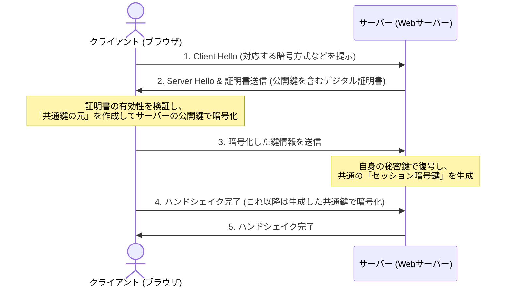

インターネット上を流れるデータは常に盗聴や改ざんのリスクに晒されています。本章では、通信経路全体を保護する **HTTPS（SSL/TLS）** の仕組みと、ログイン情報を安全に保持するための **セキュアCookie** の設定について学びます。

---

## 1. HTTPS (Hypertext Transfer Protocol Secure)

HTTPSは、HTTPに暗号化機能である **SSL/TLS（Secure Sockets Layer / Transport Layer Security）** を組み合わせたプロトコルです。以下の3つの重要な役割を持っています。

1.  **暗号化 (Confidentiality)**: 通信内容を暗号化し、経路上の第三者による盗聴を防ぎます。
2.  **改ざん検知 (Integrity)**: 通信データが途中で書き換えられていないことを保証します。
3.  **認証 (Authentication)**: 接続先のサーバーが本物であることを「デジタル証明書」を用いて証明し、なりすましを防ぎます。

### SSL/TLS ハンドシェイクの流れ（図解）

通信の開始時に、クライアント（ブラウザ）とサーバー間で暗号化に必要な情報（共通鍵）を安全に交換するプロセスです。



---

## 2. セッション管理とセキュアCookie

認証が完了した後、そのログイン状態を維持するために通常は「セッションID」や「JWTトークン」をCookieに保存してブラウザとサーバー間でやり取りします。このCookieが悪意あるスクリプトや盗聴によって盗まれないよう、適切な属性を設定する必要があります。

### Cookieのセキュリティ属性

Cookieを発行する際は、以下の属性を必ず指定するようにします。

*   **`HttpOnly`**:
    JavaScript (`document.cookie` など) からのアクセスを禁止します。これにより、万が一サイトがXSS脆弱性によって攻撃されても、Cookie内のセッションIDが不正にスクリプトで読み取られるのを防ぎます。
*   **`Secure`**:
    HTTPS（暗号化通信）の時のみCookieを送信するように制限します。HTTP（非暗号化通信）での送信を防ぎ、ネットワーク上での盗聴リスクを排除します。
*   **`SameSite`**:
    前述の通り、外部の別サイトから送信されるリクエスト（CSRFなど）に対してCookieが添付される条件を制限します。

### セキュアなCookie設定のコード例 (Next.js App Router)

Next.js の Server Actions や Route Handlers において、Cookieを安全にセットする例を示します。

```typescript:auth.ts
import { cookies } from 'next/headers';

export async function loginUser(token: string) {
  const cookieStore = await cookies();

  cookieStore.set('auth_token', token, {
    httpOnly: true, // XSS対策
    secure: process.env.NODE_ENV === 'production', // 本番環境ではHTTPSのみ送信
    sameSite: 'lax', // CSRF対策
    path: '/',
    maxAge: 60 * 60 * 24 * 7, // 1週間有効
  });
}
```

---

## まとめ

*   **HTTPS** は公開鍵暗号と共通鍵暗号を組み合わせて、**盗聴・改ざん・なりすまし** を防ぐ。
*   セッション管理で使用するCookieには **`HttpOnly`**、**`Secure`**、**`SameSite`** を必ず指定してセキュリティを強固にする。
