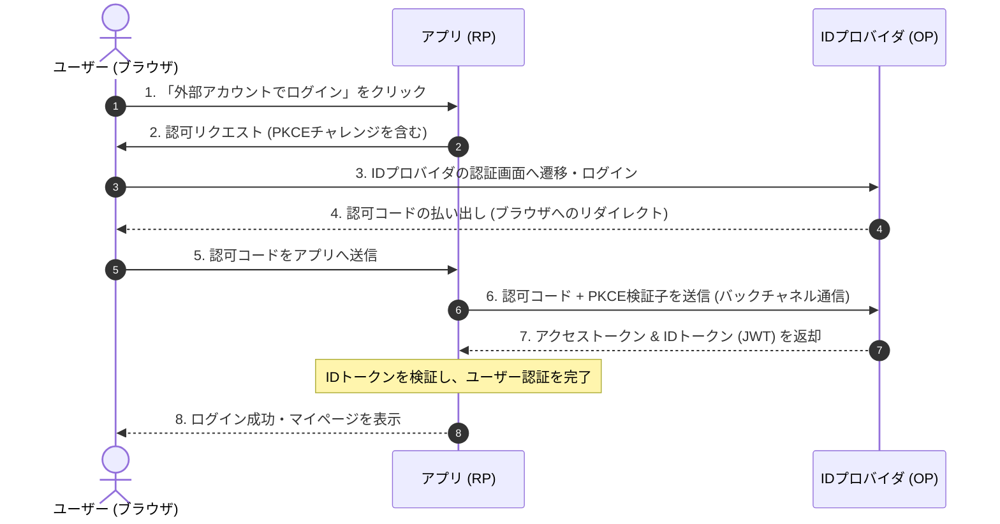

Webアプリケーションが外部サービスと連携したり、より簡単で安全にログインできるようにするため、現代のWebセキュリティ設計では「外部認証・認可プロトコル」や「パスワードレス認証」が欠かせない要素となっています。

第4章では、混同しやすい「認証」と「認可」の違い、デファクトスタンダードである **OAuth 2.1 / OIDC**、そしてパスワードの漏洩リスクを根本的に排除する **Passkey（パスワードレス認証）** について学びます。

---

## 1. 「認証」と「認可」の違い

セキュリティの設計において、**認証（Authentication）**と**認可（Authorization）**は明確に区別する必要があります。

*   **認証 (Authentication)**: 「あなたは誰ですか？」を確認する処理（本人確認）。
    *   *例: ID/パスワードの入力、生体認証、ワンタイムコードによる本人確認。*
*   **認可 (Authorization)**: 「あなたには何をする権限がありますか？」を確認・付与する処理（権限移譲）。
    *   *例: サードパーティ製アプリに対し、「私の代わりにGoogleカレンダーの予定を読み込む権利」を与えること。*

---

## 2. OAuth 2.1 と OpenID Connect (OIDC)

### OAuth 2.1 とは？
OAuth（オーオース）は、安全に「認可」を行うための業界標準プロトコルです。最新の **OAuth 2.1** では、セキュリティの脆弱性が指摘されていた古い仕組み（Implicit Flowなど）が廃止され、セキュリティ強度の高い **認可コードフロー + PKCE** が事実上の必須仕様となりました。

> [!NOTE]
> **PKCE (ピクシー)** とは、クライアントが一時的な暗号コード（コード検証子）を生成し、認可コードの引き換え時にそれを照合することで、途中でコードが盗まれても不正利用を防ぐ仕組みです。

### OpenID Connect (OIDC) とは？
OAuth 2.0 はあくまで「認可（権限付与）」のための仕様であり、誰がログインしたかを証明する「認証」の仕組みを持っていませんでした。そこで、OAuth の上に本人情報を伝えるレイヤーを重ねたのが **OpenID Connect (OIDC)** です。これにより、ソーシャルログイン（GoogleやGitHubアカウントでのログイン）が実現しています。

### OIDC ログイン認証フロー（図解）

---

## 3. パスワードレス認証（FIDO2 と Passkey）

長年使われてきた「ID/パスワード」の認証方式には、パスワードの使い回しによるアカウント乗っ取りや、偽サイトに入力させて資格情報を盗む「フィッシング詐欺」といった重大な欠陥があります。

これを根本から解決するために策定された標準規格が **FIDO2（ファイドツー）** であり、それを一般のユーザーが手軽に扱えるようにした実装が **Passkey（パスキー）** です。

### パスキーの動作原理
パスキーは、**公開鍵暗号方式**を採用しています。

1.  **登録時**: デバイス（スマートフォンやPCの生体認証）で「秘密鍵」を生成して安全に保管し、サーバーへ「公開鍵」を登録します。
2.  **認証時**: サーバーから送られてきたランダムなデータ（チャレンジ）に対し、デバイスの秘密鍵で署名を作成してサーバーへ送り返します。サーバーは登録済みの公開鍵を使って署名を検証し、本人であることを確認します。

### 主なセキュリティ上の強み
*   **パスワードの廃止**: サーバー側には「公開鍵」しか保存されないため、万が一サーバーからデータが漏洩しても、アカウントが乗っ取られる心配はありません。
*   **強力なフィッシング耐性**: 署名処理はアクセスしているドメイン名（URL）と紐づいて実行されるため、ユーザーが巧妙なフィッシングサイトに騙されて騙しリンクを踏んだとしても、ブラウザがドメインの不一致を検知して署名を拒否します。
*   **デバイス同期**: クラウドキーチェーン（iCloudやGoogleパスワードマネージャーなど）を介してデバイス間で秘密鍵が安全に同期されるため、端末の紛失時にもアカウントへのアクセスを復旧できます。

---

## まとめ

*   **認証**は「本人の特定」、**認可**は「権限の付与」を指す。
*   **OAuth 2.1** はセキュリティを強化した認可プロトコルで、すべてのクライアントで **PKCE** の利用が必須化される流れにある。
*   **OpenID Connect (OIDC)** は OAuth の仕組みを拡張した「認証」プロトコルで、ソーシャルログインを支えている。
*   **Passkey** は公開鍵暗号方式を利用したフィッシング耐性の高いパスワードレス認証方式。
