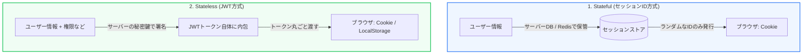

Webアプリケーションでユーザーのログイン状態を保持する「セッション管理」は、ハッカーから最も狙われやすい部分の一つです。近年では従来のセッションID方式に加え、SPA（Single Page Application）の普及に伴い **JWT（JSON Web Token）** を使ったステートレスなトークン認証が主流となっていますが、これには特有のセキュリティ上の注意点があります。

第5章では、セッションIDとJWTの仕組みの違いと、トークンを安全に管理するためのベストプラクティスについて学びます。

---

## 1. セッション管理の2つのアプローチ

ユーザーがログインしたことを示す「認証状態」を管理するアプローチは、主に以下の2種類です。



* **セッションID方式 (Stateful)**:
  * サーバー側に「セッション情報（誰がいつログインしたか）」を保存し、クライアントにはその場所を示すランダムな文字列（セッションID）のみを渡します。サーバーのメモリやDBを消費しますが、サーバー側から強制的にログアウト（セッション破棄）させることが容易です。
* **JWT方式 (Stateless)**:
  * ユーザーIDや権限などの情報をJSONデータにし、サーバーの秘密鍵でデジタル署名したトークンをクライアントに丸ごと持たせます。サーバーはDBに問い合わせることなく、署名を検証するだけで認証が完了するためスケーラブルですが、一度発行したトークンを有効期限前に無効化（強制ログアウト）するのが難しいというトレードオフがあります。

---

## 2. JWT（JSON Web Token）の構造

JWTはドット（`.`）で区切られた3つの文字列（Base64URLエンコード）で構成されています。

```text
Header.Payload.Signature
```

1. **Header (ヘッダー)**: トークンのタイプ（JWT）や、使用されている署名アルゴリズム（例: `HS256`, `RS256`）を示します。
2. **Payload (ペイロード)**: 実際のデータ（クレーム）が含まれます（例: ユーザーID、名前、有効期限 `exp`）。※Base64でエンコードされているだけなので、**誰でもデコードして中身を読むことができます**。パスワードなどの機密情報は絶対に含めてはいけません。
3. **Signature (署名)**: ヘッダー、ペイロード、サーバーしか知らない秘密鍵を合わせてハッシュ化して生成します。これにより、クライアント側でペイロードが改ざんされた場合、サーバー側で署名の検証が失敗し、改ざんを検知できます。

---

## 3. トークンの安全な保存先とCookie属性

クライアントでトークンをどこに保存するかは、XSS（JavaScriptインジェクション）とCSRF（リクエスト強要）の脆弱性に対するトレードオフになります。

### Web Storage (localStorage) への保存
* **メリット**: 実装が非常に簡単。CSRF攻撃に対して完全に安全（リクエストに自動付与されないため）。
* **デメリット**: XSS脆弱性がある場合、悪意あるJavaScriptによってトークンが簡単に読み取られ、盗まれてしまいます。

### Cookie への保存（推奨）
セキュリティのために以下の **Cookie属性** を厳格に付与して保存します。

* **`HttpOnly`**: JavaScriptからのCookieの読み取りを禁止します。これで **XSSによるトークン窃取を防ぎます**。
* **`Secure`**: HTTPS通信（暗号化）のときのみCookieを送信します。
* **`SameSite=Lax` / `Strict`**: 他のサイト（クロスサイト）からのリクエスト時にCookieが送信されるのを制限します。これで **CSRF攻撃を防ぎます**。

セッションストアの負荷軽減のために安易にLocalStorageにJWTを保存する設計は避け、セキュアな属性を設定したCookieを使用することが、実務における安全な認証設計の鉄則です。
