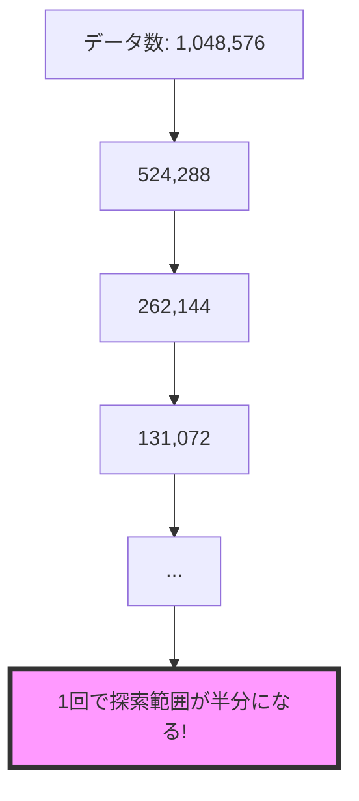

プログラミング、特にアルゴリズムの学習を進めていると、「数学」の知識が必要になる場面にしばしば遭遇します。
「数学は苦手だったからプログラミングは難しいかも…」と不安に感じる方もいるかもしれませんが、ご安心ください。アルゴリズムでよく使われる数学の概念は限られており、高校や大学で学ぶような難解な数式を全て理解する必要はありません。

この記事では、アルゴリズムの理解と実装において特に重要となる数学的な考え方を、具体的なプログラミングの文脈（TypeScriptの例）と結びつけて詳しく紹介します。

## 1. 離散数学：論理演算と集合

コンピュータは $0$ と $1$ のデジタルな世界であり、連続的ではない「離散的」な値を扱います。そのため、アルゴリズムの基礎には離散的な構造を扱う「離散数学」があります。

### 論理演算 (Boolean Logic & Bitwise Operations)

もっとも身近なのが「論理演算」です。条件分岐だけでなく、ビット単位での高速な操作にも使われます。

| 演算        | 名前         | 説明                                  |
| :---------- | :----------- | :------------------------------------ |
| `AND` (`&`) | 論理積       | 両方のビットが $1$ のときのみ $1$     |
| `OR` (`\|`) | 論理和       | 少なくとも一方のビットが $1$ なら $1$ |
| `NOT` (`~`) | 否定         | ビットを反転させる                    |
| `XOR` (`^`) | 排他的論理和 | 入力が異なる（片方が $1$）ときに $1$  |

特に **XOR** は、同じ値に対して適用すると $0$ になる性質を利用して、フラグの反転や簡易的な暗号化に利用されます。

```typescript
// ビット演算による高速な判定例
const isActive = 0b1010; // 10 (二進数)
const hasPermission = 0b1100; // 12 (二進数)

// 両方のフラグが立っているかを確認 (AND)
console.log((isActive & hasPermission) !== 0); // true
```

### 集合論 (Set Theory)

データの集まり（コレクション）を扱う際、数学的な「集合」の考え方が不可欠です。JavaScript/TypeScript の `Set` オブジェクトはまさにこれに基づいています。

実務では、配列同士の共通項を取り出したり、重複を除外したりする操作として頻繁に現れます。

```typescript
const setA = new Set([1, 2, 3]);
const setB = new Set([2, 3, 4]);

// 積集合 (Intersection): 両方に共通する要素
const intersection = new Set([...setA].filter((x) => setB.has(x))); // {2, 3}

// 和集合 (Union): すべての要素を合わせる
const union = new Set([...setA, ...setB]); // {1, 2, 3, 4}

// 差集合 (Difference): AにはあるがBにはない要素
const difference = new Set([...setA].filter((x) => !setB.has(x))); // {1}
```

## 2. 対数（Logarithm）

計算量の見積もり（オーダー記法）において、**$O(\log n)$** という表記をよく見かけます。ここで登場する「対数（$\log$）」は、アルゴリズムの効率性を語る上で欠かせない概念です。

### データの半減と対数

プログラミングにおける対数の底は、一般的に $2$ です（$\log_2 n$）。これは、「データ量 $n$ を半分に割り続けると、何回で $1$ になるか？」を意味します。

代表的な例が**二分探索 (Binary Search)** です。ソート済みの配列から特定の要素を探す際，中央の値と比較して探索範囲を半分ずつに絞り込んでいきます。



データ量が $1,000,000$ あっても、わずか約 $20$ 回の比較で見つけることができるという驚異的な効率性は、この対数の性質に支えられています。

## 3. 漸化式と数列

ある項がそれ以前の項を用いて定義される数式のことを漸化式と呼びます。

### 再帰関数と動的計画法

漸化式は、プログラミングにおける**再帰関数（Recursive function）**に直結します。
例えば、フィボナッチ数列（$F_n = F_{n-1} + F_{n-2}$）を考えると、実装方法は大きく分けて2つあります。

#### 1. 素朴な再帰（時間がかかる例）

単純に定義通りに書くと、同じ計算が何度も繰り返されます。

```typescript
function fib(n: number): number {
  if (n <= 1) return n;
  return fib(n - 1) + fib(n - 2); // ここで重複した計算が発生する
}
```

#### 2. 動的計画法 / メモ化（効率的な例）

計算結果を保存しておく「メモ化」を用いることで、計算量を劇的に減らすことができます。これが**動的計画法 (Dynamic Programming; DP)** の基本的な考え方です。

```typescript
const memo = new Map<number, number>();

function fibMemo(n: number): number {
  if (n <= 1) return n;
  if (memo.has(n)) return memo.get(n)!; // すでに計算済みなら即座に返す

  const result = fibMemo(n - 1) + fibMemo(n - 2);
  memo.set(n, result); // 計算結果を保存
  return result;
}
```

## 4. グラフ理論

ここで言う「グラフ」は、棒グラフや折れ線グラフではなく、**「頂点（ノード）」とそれを結ぶ「辺（エッジ）」で構成される構造**のことです。

### アルゴリズムにおける重要性

現実世界の多くの問題は、グラフとしてモデル化できます。

- **最短経路問題**: カーナビのルート探索、ネットワークのルーティング（ダイクストラ法など）。
- **ソーシャルグラフ**: SNS におけるユーザー間のフォロー関係（幅優先探索を用いた「友達の友達」検索）。
- **依存関係の解決**: パッケージマネージャにおけるライブラリの依存関係（トポロジカルソート）。

### 実装の基本：隣接リスト (Adjacency List)

プログラミングでグラフを表現する際、最も一般的に使われるのが「隣接リスト」です。これは、各頂点からどの頂点へエッジが伸びているかをリスト（配列）で保持する方法です。

```typescript
// 隣接リストによるグラフの表現例
type Graph = { [key: number]: number[] };

const graph: Graph = {
  0: [1, 2], // 頂点0から1と2へエッジ
  1: [2], // 頂点1から2へエッジ
  2: [0, 3], // 頂点2から0と3へエッジ
  3: [3], // 自己ループ
};

// 頂点0に隣接しているのは？
console.log(graph[0]); // [1, 2]
```

グラフを探索する代表的なアルゴリズムである **幅優先探索 (BFS)** や **深さ優先探索 (DFS)** を理解しておくと、複雑なデータ構造もスムーズに扱えるようになります。

## 5. 確率と統計

データの分析や機械学習の分野に限らず、一般的なプログラミングでも確率論が役立つ場面は多いです。

- **乱数の生成と活用**: ランダムに要素をシャッフルしたり、ゲームのガチャの確率を実装したりする際に、一様分布や正規分布といった確率分布の考え方が必要になります。
- **モンテカルロ法**: 乱数を用いてランダムなシミュレーションを多数回行い、円周率などの近似値を求める手法です。
- **ハッシュ関数**: ハッシュテーブルでデータの衝突（コリジョン）が起きる確率を抑えるための設計には、確率の知識が潜んでいます。

## 6. 行列と線形代数

一見すると複雑な数式の羅列に見える行列ですが、データを「多次元の配列」として扱うための強力なツールです。

- **3D グラフィックス**: オブジェクトの回転、拡大縮小、平行移動などの座標変換は、すべて行列の掛け算によって計算されています。
- **機械学習とディープラーニング**: 大量のデータを一度に処理（テンソル演算）するため、内部的には膨大な行列演算が行われています。

## まとめ

アルゴリズムで使う数学は、決して机上の空論ではなく、「現実の問題をコンピュータに効率よく解かせるための道具」です。

- 論理を整理するための「離散数学」
- 効率化の威力を示す「対数」
- 複雑な問題を分割する「漸化式」
- 関係性を表現する「グラフ理論」

これらを完璧にマスターしてからプログラミングを始める必要はありません。プログラミングで壁にぶつかったときや、より効率的なアルゴリズムを学びたいときに、「そういえばこれはあの数学の概念だな」と紐づけて少しずつ学んでいくのが、最も実践的で楽しい学習方法だと思います。
