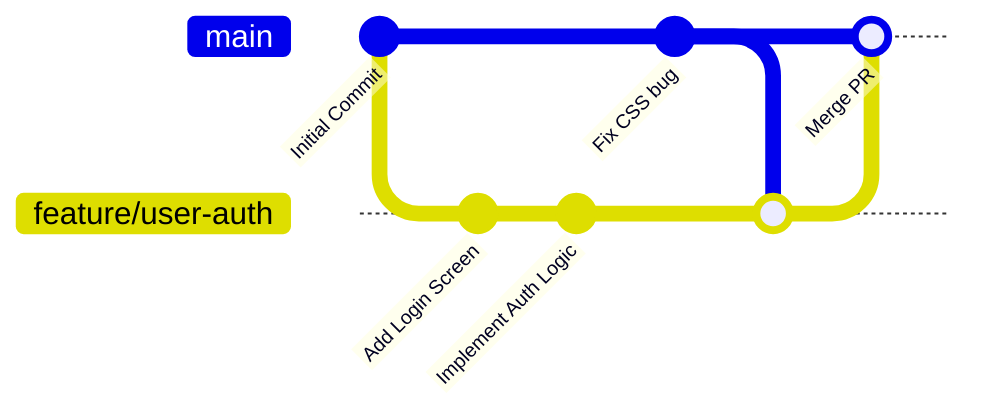

エンジニアとしてのキャリアの中で、あるいは趣味のプロジェクトとして、私たちは「個人開発（ソロ開発）」と「チーム開発」という2つの異なる開発スタイルを経験します。

一見すると、どちらも「コードを書いてシステムを構築する」という点で同じに見えるかもしれません。しかし、そのプロセス、意思決定、重視されるスキル、そして直面する課題は大きく異なります。

本記事では、これら2つの開発スタイルの本質的な違いを多角的に比較し、それぞれがエンジニアの成長にどのように寄与するかを考察します。

---

## 1. 意思決定と開発のスピード

開発における「意思決定のプロセス」は、個人とチームで最も顕著に異なる部分です。

### 個人開発：圧倒的な自由とスピード
個人開発における最大の強みは、**意思決定の速さと絶対的な自由**です。
- 技術選定、システムアーキテクチャ、UIデザイン、機能の追加・削除にいたるまで、すべて自分一人で即座に決定できます。
- 会議や合意形成のコストはゼロであり、「思い立ったらその場でコードを書き換える」という俊敏な開発（Vibe Codingに近いスタイル）が可能です。

### チーム開発：合意形成と合理的な説明責任
チーム開発では、プロジェクトが大きくなるにつれて**意思決定にプロセスが必要**になります。
- プロダクトマネージャー（PM）、デザイナー、他のエンジニア、時にはセキュリティチームなど、多様なステークホルダーとの協調が不可欠です。
- 技術選定やアーキテクチャの変更には、合理的な説明責任が伴います。多くの組織では、設計書（Design Doc）やRFC（Request for Comments）を作成し、チーム内でのレビューと合意形成を経てから実装に進みます。
- 意思決定には時間がかかりますが、多角的な視点でレビューされるため、致命的な設計ミスやセキュリティ上のリスクを事前に回避しやすくなります。

---

## 2. 技術選定とコードの品質（持続可能性）

コードの「書き方」や「メンテナンス性」に対する意識も、誰がそのコードを維持管理するのかによって変わります。

### 個人開発：最新技術の実験場
個人開発は、**新しい技術を自由に試せる絶好の機会**です。
- まだ本番運用実績の少ない最新のフレームワークやライブラリ、あるいは奇抜なアーキテクチャを自分の判断で導入できます。
- 一方で、「自分が理解できれば良い」という甘えが生じやすく、ドキュメントの作成や厳密な命名規則の遵守が怠られがちです。その結果、数ヶ月後に自分でコードを見直した際、解読に時間がかかる「セルフ技術的負債」を抱えることがよくあります。

### チーム開発：標準化と持続可能性
チーム開発では、メンバーの入れ替わりを前提とした**持続可能性（サステナビリティ）**が最優先されます。
- 技術選定では、誰でもキャッチアップしやすい「枯れた（実績のある）技術」や、コミュニティが活発な技術が好まれます。
- 静的解析ツール（Linter）やコードフォーマッター（Prettierなど）によるコードスタイルの強制、およびチームメンバーによる「コードレビュー」が義務付けられます。
- 「他のメンバーが読んでも10分で理解できるコード」が理想とされ、属人性を排除した読みやすさ（可読性）と変更の容易性（拡張性）が極めて重視されます。

---

## 3. バージョン管理とワークフロー

Gitをはじめとするバージョン管理ツールの使い方も、共同作業者がいるかどうかで役割が変わります。

### 個人開発：シンプルな履歴記録
個人開発におけるバージョン管理は、主に**履歴のバックアップとローカルでの試行錯誤**のために使われます。
- 基本的には`main`（または`master`）ブランチへ直接コミットすることが多く、コンフリクト（コードの衝突）が発生することはまずありません。
- コミットメッセージも「fix」や「update」といった簡素なもので済ませてしまうことが多く、履歴の綺麗さよりも作業の連続性が優先されます。

### チーム開発：協調作業のための高度なブランチ戦略
チーム開発では、Gitは**作業の競合を防ぎ、リリースラインを安定させるためのインフラ**となります。
- Git FlowやGitHub Flowなどのブランチ戦略に基づき、役割ごとに`feature`ブランチを切り、Pull Request（またはMerge Request）を作成してコードレビューを受けます。
- 複数人が同時に同じファイルを修正することによる「コンフリクトの解消」は日常茶飯事であり、コンフリクトを最小限に抑えるための適切なモジュール分割や細分化されたコミットが求められます。
- CI/CDパイプラインと連携し、プルリクエストが作成された時点で自動テストが走り、ビルドが通ることを確認してからマージする仕組みが構築されます。

---

## 4. 品質管理とテスト

バグが混入した際の影響範囲と、それに伴うテストの重要性も大きく異なります。

### 個人開発：手動テストと即時修正
個人開発では、テストコードを細かく書くケースは比較的稀です。
- 基本的には開発者がローカル環境で画面を動かして確認する「手動テスト」が中心になります。
- 万が一バグが本番環境で発生しても、影響を受けるユーザーが少なければ、その場ですぐにコードを修正して再デプロイすれば済むため、テスト自動化に対する費用対効果（投資利益率）が低くなりやすいからです。

### チーム開発：多重の防御策と自動テスト
チーム開発では、バグの発生が**ビジネス上の損失やユーザーの信頼低下に直結**します。
- 変更による既存機能へのデグレ（デグレーション）を防ぐため、ユニットテスト（単体テスト）、インテグレーションテスト（結合テスト）、E2Eテスト（エンドツーエンドテスト）などの自動テストを高い網羅率で記述することが推奨されます。
- 大規模なプロジェクトでは、専任のQA（品質保証）エンジニアがテスト計画を策定し、シナリオテストや負荷テストなどを実行して多角的に品質を担保します。

---

## 5. コミュニケーションとタスク管理

最後にして最も大きな違いは、やはり「コミュニケーション」の有無です。

| 比較項目 | 個人開発 | チーム開発 |
| :--- | :--- | :--- |
| **主なタスク管理** | 頭の中、簡易メモ、GitHub Issues | Jira、Trello、GitHub Projects（カンバン） |
| **コミュニケーション** | 不要（自己完結） | デイリースクラム、Slack、ドキュメンテーション |
| **主なボトルネック** | 開発者本人の時間と技術力 | 認識のズレ、待ち時間、調整コスト |
| **必要なソフトスキル** | 自己管理能力、モチベーション維持 | 傾聴力、言語化能力、テキストコミュニケーション |

### 個人開発：自己管理能力が鍵
コミュニケーションの相手がいないため、すべての時間を「実装」に充てることができます。その代わり、開発を継続するための**モチベーション維持や、優先順位の自己管理**が非常に難しくなります。

### チーム開発：言語化と「待ち時間」の管理
チーム開発で最も時間を使うのは、コードを書くことではなく「**コミュニケーション**（**合意形成や認識のすり合わせ**）」です。
- 口頭だけでなく、SlackやNotionなどのテキストコミュニケーションで「仕様や意図を正確に言語化する能力」が不可欠です。
- 自分が実装を始める前にデザイナーの成果物を待つ、自分が書いたコードがレビューされるのを待つ、といった「他者との依存関係（待ち時間）」をどのようにコントロールするかが、プロジェクトの成否を分けます。

---

## まとめ：エンジニアとして成長するための両輪

個人開発とチーム開発は、どちらが優れているというものではありません。それぞれ異なる筋肉を鍛えることができる「**エンジニアの成長における両輪**」です。

- **個人開発**を経験することで、インフラからフロントエンド、デザインまでを一人でカバーする**「全体を俯瞰する視野（0から1を生み出す力）」**が養われます。
- **チーム開発**を経験することで、複雑なシステムをバグなく運用し、大人数で効率よくスケールさせる「**コラボレーションと持続可能な設計力**（**1を10や100にする力**）」が養われます。

両方の開発スタイルをバランスよく経験し、それぞれの良さを互いの領域にフィードバックさせること（例：個人開発で培った俊敏性をチーム開発の提案に活かす、チーム開発で学んだクリーンコードや自動テストの仕組みを個人開発に逆輸入するなど）が、一流のエンジニアへの近道と言えるでしょう。
